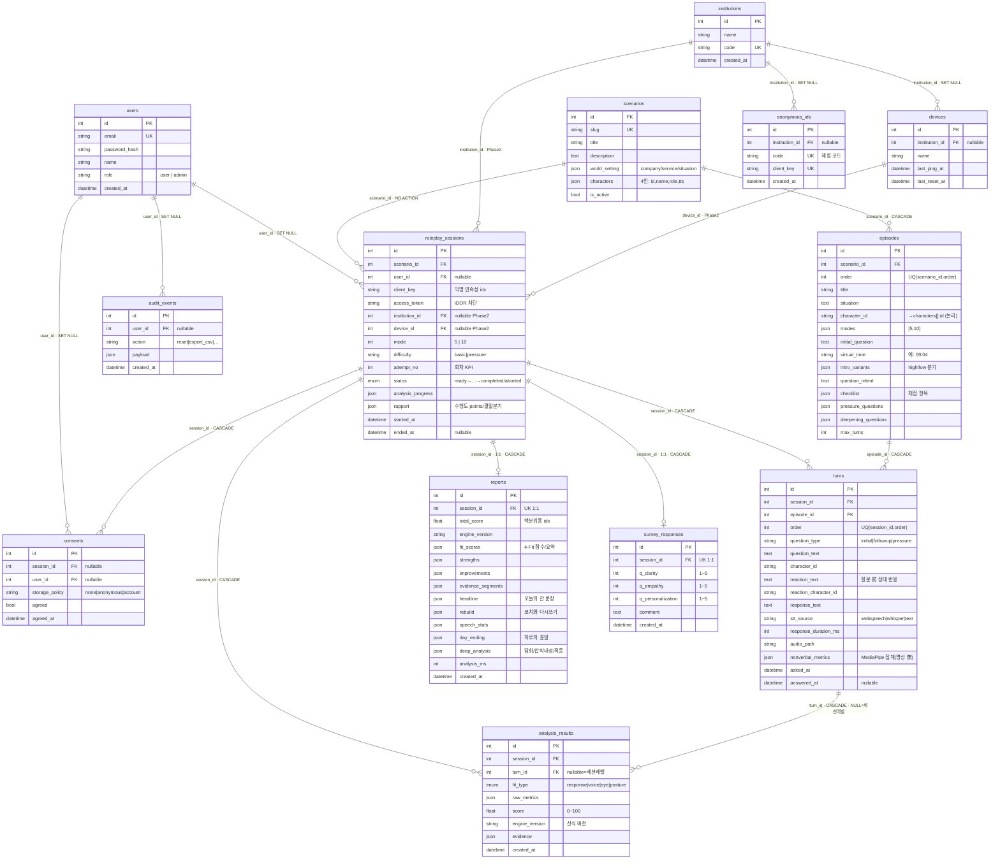
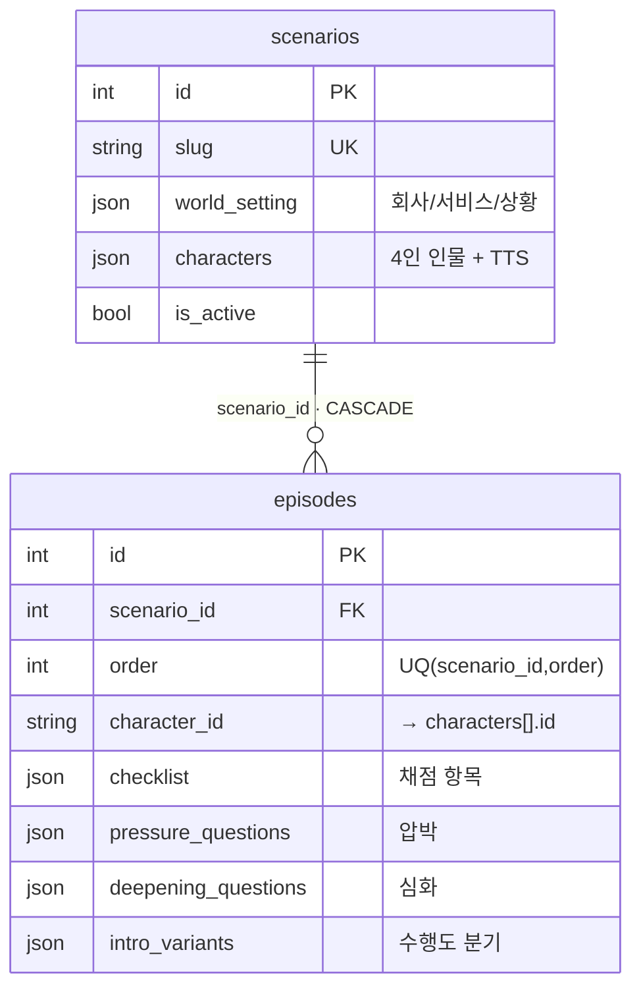
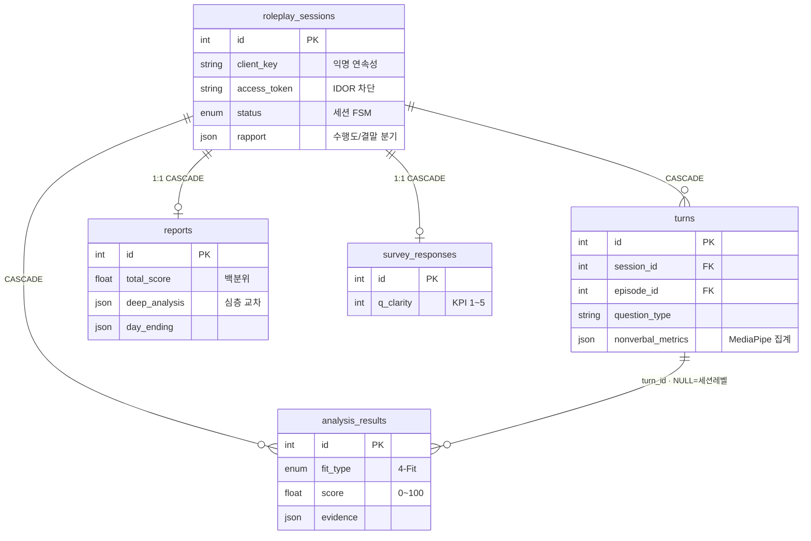
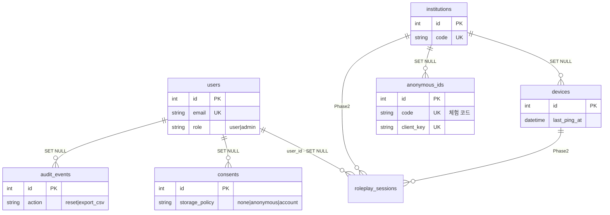
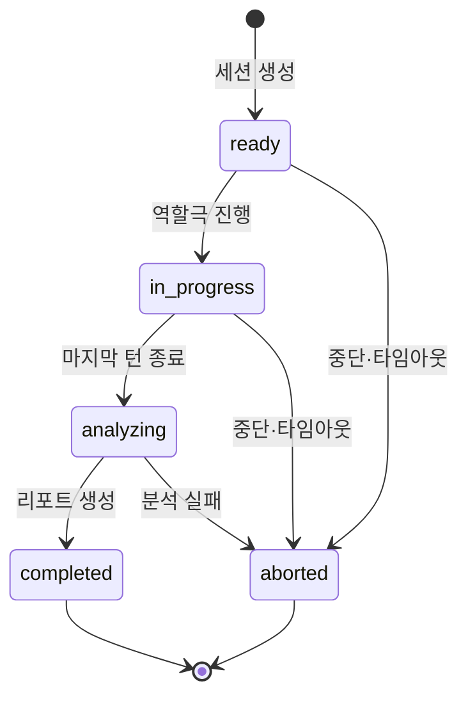

# 4-Fit 미러팅 — 데이터베이스 ERD

> **정본**: [`backend/app/models/models.py`](../backend/app/models/models.py). 이 문서는 거기서 파생된 시각화·참조표다.
> 설계 원칙·Phase B(기관 납품) 목표 스키마는 [`docs/database-design.md`](database-design.md)를 본다.
> 갱신: 2026-07-11 · 테이블 13개 · 외래키 16개

---

## 0. 표기법 (범례)

- 표기: Mermaid **crow's-foot**. `||--o{` = 1:N, `||--o|` = 1:0..1(선택적 1:1).
- 컬럼 태그: `PK` 기본키 · `FK` 외래키 · `UK` UNIQUE.
- 관계선 라벨 = **FK 컬럼 · ondelete 동작**(`CASCADE` 딸려 삭제 / `SET NULL` FK만 비움 / `NO ACTION` 삭제 차단).
- ⚠️ SQLite는 기본 FK **OFF**다. 모든 CASCADE/SET NULL은 [`core/database.py`](../backend/app/core/database.py)의 연결별 `PRAGMA foreign_keys=ON`이 켜 줄 때만 작동한다.

---

## 1. 전체 ERD (13 테이블)

---

## 2. 도메인별 상세 뷰

13개를 한 번에 보면 빽빽하니, 세 덩어리로 나눠 읽는다.

### 2-1. 콘텐츠 (정적 — 시드로 채워지는 세계관)

`scenarios.characters`는 **JSON 배열**이라 별도 테이블이 아니다. `episodes.character_id`/`turns.character_id`는 그 배열의 `id`를 가리키는 **논리 참조**(6절).

### 2-2. 체험 파이프라인 (동적 — 한 번의 역할극이 남기는 것)

허브는 `roleplay_sessions`. 한 세션이 여러 `turns`를 낳고, 각 턴(또는 세션 전체)에 대해 4-Fit `analysis_results`가 쌓이며, 최종적으로 `reports` 1건과 `survey_responses` 1건으로 마감된다.

### 2-3. 운영·기관 확장 (사용자·동의·감사 + Phase 2 골격)

`institutions`·`devices`와 세션의 `institution_id`/`device_id`는 지금 전시(단일 테넌트)에선 전부 `NULL`이다. 기관 납품(Phase B)에서 켤 자리만 미리 잡아둔 **전방 호환 골격**이며, nullable이라 [`_migrate_columns`](../backend/app/seed/run.py)가 기존 DB에 무손실로 추가한다.

---

## 3. 세션 상태 기계 (`roleplay_sessions.status`)

부분 인덱스 `ix_sessions_active`가 `ready`/`in_progress`/`analyzing` **활성 상태만** 색인한다 — 전시 1클릭 초기화가 활성 세션을 빠르게 훑기 위한 설계다.

---

## 4. 관계·삭제 전파 매트릭스

| 부모 | 자식 | FK 컬럼 | 관계 | ondelete | 의미 |
|---|---|---|---|---|---|
| users | roleplay_sessions | `user_id` | 1:N | SET NULL | 익명 체험은 `user_id` NULL |
| users | consents | `user_id` | 1:N | SET NULL | 계정 삭제해도 동의 이력 보존 |
| users | audit_events | `user_id` | 1:N | SET NULL | 무인증 운영 기간은 NULL |
| scenarios | episodes | `scenario_id` | 1:N | **CASCADE** | 시나리오 삭제 → 에피소드 제거 |
| scenarios | roleplay_sessions | `scenario_id` | 1:N | NO ACTION | 사용 중 시나리오 삭제 차단 |
| roleplay_sessions | consents | `session_id` | 1:N | **CASCADE** | |
| roleplay_sessions | turns | `session_id` | 1:N | **CASCADE** | |
| roleplay_sessions | analysis_results | `session_id` | 1:N | **CASCADE** | |
| roleplay_sessions | reports | `session_id` | 1:0..1 | **CASCADE** | UNIQUE(1:1) |
| roleplay_sessions | survey_responses | `session_id` | 1:0..1 | **CASCADE** | UNIQUE(1:1) |
| episodes | turns | `episode_id` | 1:N | **CASCADE** | 재시드 시 턴 정리 |
| turns | analysis_results | `turn_id` | 1:N | **CASCADE** | `turn_id` NULL = 세션 레벨 결과 |
| institutions | roleplay_sessions | `institution_id` | 1:N | NO ACTION | Phase 2 (현재 NULL) |
| institutions | devices | `institution_id` | 1:N | SET NULL | |
| institutions | anonymous_ids | `institution_id` | 1:N | SET NULL | |
| devices | roleplay_sessions | `device_id` | 1:N | NO ACTION | Phase 2 (현재 NULL) |

**전시 리셋의 핵심**: `roleplay_sessions` 한 행을 지우면 `consents`·`turns`·`analysis_results`·`reports`·`survey_responses`가 전부 CASCADE로 딸려 내려간다(단, `PRAGMA foreign_keys=ON` 전제).

---

## 5. 제약·인덱스 카탈로그

| 테이블 | UNIQUE | CHECK | INDEX |
|---|---|---|---|
| users | `email` | `role IN (user,admin)` | `email` |
| consents | — | `session_id OR user_id NOT NULL` · `storage_policy IN (none,anonymous,account)` | `session_id` |
| scenarios | `slug` | — | — |
| episodes | `(scenario_id, order)` | — | — |
| roleplay_sessions | — | `mode IN (5,10)` · `difficulty IN (basic,pressure)` · `attempt_no >= 1` | `(client_key, id)` · `client_key` · 부분:`status`(활성만) |
| turns | `(session_id, order)` | — | `episode_id` |
| analysis_results | `(session_id, turn_id, fit_type)` | — | **부분 UNIQUE** `(session_id, fit_type)` WHERE `turn_id IS NULL` |
| reports | `session_id` | — | `total_score` |
| survey_responses | `session_id` | `q_clarity/q_empathy/q_personalization BETWEEN 1 AND 5` | — |
| audit_events | — | — | — |
| institutions | `code` | — | — |
| devices | — | — | — |
| anonymous_ids | `code` · `client_key` | — | `code` · `client_key` |

> **부분 UNIQUE 트릭**(`analysis_results`): SQLite UNIQUE는 NULL을 서로 다른 값으로 취급하므로, 일반 유니크로는 세션 레벨 결과(`turn_id IS NULL`)의 중복을 못 막는다. 그래서 `turn_id IS NULL`에만 걸리는 부분 유니크 인덱스를 추가로 둔다.

---

## 6. 논리 참조 (FK 아님 — 앱 레벨에서만 연결)

| 출발 | 도착 | 매개 |
|---|---|---|
| `episodes.character_id`, `turns.character_id`, `turns.reaction_character_id` | `scenarios.characters[].id` | JSON 배열 원소 id (테이블 아님) |
| `anonymous_ids.client_key` ↔ `roleplay_sessions.client_key` | 익명 재방문 추이 이어붙이기 | 문자열 매칭(FK 아님) |
| `reports.day_ending.character_id` 등 JSON 내부 id | `scenarios.characters[].id` | JSON 페이로드 |

이 참조들은 외래키가 아니므로 DB가 무결성을 강제하지 않는다 — 시드/서비스 코드가 책임진다.

---

## 7. 스키마 관리 요약

- **마이그레이션 도구 없음**. FastAPI `lifespan` 시작 시 [`seed()`](../backend/app/seed/run.py)가 `Base.metadata.create_all()`(없는 테이블 생성) + 시나리오 시드(멱등)를 돈다.
- 경량 마이그레이션 [`_migrate_columns()`](../backend/app/seed/run.py): 살아있는 스키마 vs 모델 메타데이터를 비교해 **누락 컬럼만 `ALTER TABLE ADD COLUMN`**. 스칼라 기본값만 DDL로 옮기고 callable(dict/utcnow)은 NULL로 둔다(읽는 쪽 `or {}` 가드가 흡수).
- **한계**: 타입 변경·컬럼 삭제는 반영 안 됨 → `mirroting.db`(+`-wal`/`-shm`) 삭제 후 재기동해 재생성. 실사용 데이터가 쌓이면 Alembic 도입이 선행 조건.
- 연결별 PRAGMA: `foreign_keys=ON`(FK 강제) · `journal_mode=WAL` + `busy_timeout=5000`(스레드풀 잠금 회피).

---

## 8. 프라이버시·보안 불변식 (스키마에 박힌 것)

- **영상 원본 미저장** — `turns.nonverbal_metrics`에 MediaPipe 집계값(JSON)만.
- **동의 저장 정책** — `consents.storage_policy` = none(미저장)/anonymous(익명)/account(계정).
- **IDOR 차단** — `roleplay_sessions.access_token`으로 순차 id 열거 방어.
- **개인정보 없는 연속성** — `client_key` + `anonymous_ids.code`(체험 코드)로 이메일·이름 없이 재방문 추이 제공.
- **파괴적 행위 감사** — 초기화·CSV 내보내기 등은 `audit_events`에 기록.
