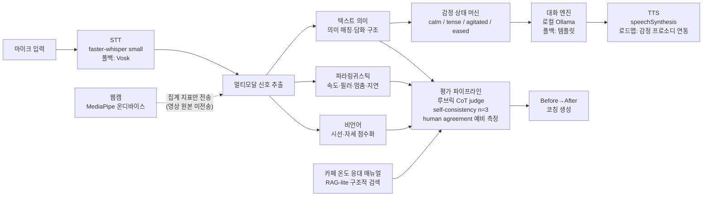

# AI 아키텍처 — B2B 발표 대비 구체화

> 상태: 확정(2026-07-31) · 작성 2026-07-31
> 관련 스펙: S-B2B-008 (임시 ID) · 연관: S-B2B-116(루브릭 가중치), S-B2B-117(judge 3겹), S-B2B-120(핫워드), S-B2B-121(TTS 프로소디)
> 근거 표기: [구현]=현재 코드에 존재 · [설계]=이 문서로 확정된 신규 설계. 발표에서 이 둘을 섞어 말하지 않는다.

---

## 0. 한 장 요약

> **STT → 멀티모달 신호 추출(텍스트 의미 + 파라링귀스틱 음성 지표 + 비언어) → 감정 상태 기반 대화 엔진 → 검증된 평가 파이프라인(루브릭 CoT judge + self-consistency n=3 + human agreement 예비 측정) → Before→After 코칭 생성.**
> 전 구간 외부 API 무의존 — 모든 LLM은 로컬 Ollama, 폴백은 결정적 파이프라인. [구현: 폴백 계층 / 설계: 감정 상태 머신·judge 3겹]

## 1. 파이프라인 다이어그램

- STT 폴백·대화 엔진 폴백·온디바이스 비언어 집계는 [구현]. 감정 상태 머신·judge 3겹·RAG-lite는 [설계].
- **RAG-lite**: 카페 온도 응대 매뉴얼 1개를 구조적 검색으로 평가 기준에 주입한다. 구조는 RAG이되, EXPO 버전은 단일 매뉴얼이다 — "매뉴얼을 갈아끼우면 브랜드별 평가 기준이 바뀐다"는 확장 구조를 단일 문서로 증명하는 설계다.

## 2. 감정 상태 머신 [설계]

### 상태 정의

| 상태 | 이름 | 상대역(예: 진상 고객)의 표현 |
|---|---|---|
| `calm` | 평온 | 일상 톤. 요구 사항을 말로 전달 |
| `tense` | 경계 | 말이 짧아지고 재촉. 불만이 표면화 |
| `agitated` | 격앙 | 언성·요구 강도 상승. 에스컬레이션 위협 |
| `eased` | 완화 | 격앙에서 내려오는 과도 상태. 수용적이지만 아직 조심스러움 |

### 전이 표

전이 입력은 턴별 답변 품질 판정 케이스(excellent / covered / missing / short / risky)다. Response-Fit의 의미 매칭 판정을 전이 신호로 재사용한다.

| 현재 \ 판정 | excellent | covered | missing | short | risky |
|---|---|---|---|---|---|
| **calm** | calm | calm | tense | tense | agitated |
| **tense** | eased | calm | agitated | tense (유지) | agitated |
| **agitated** | eased | tense | agitated (유지) | agitated (유지) | agitated (유지) |
| **eased** | calm | calm | tense | eased (유지) | tense |

설계 규칙:

- **격앙에서 평온으로 직행하지 않는다** — 반드시 `eased`를 경유한다. 사람의 감정이 그렇게 식지 않기 때문이고, 플레이테스트에서 "감정 급락"은 심각도 상으로 기록된다([플레이테스트 프로토콜](playtest-protocol.md)).
- `risky`(금지어·위험 발화)는 어느 상태에서든 악화 방향으로만 작동한다.
- 상태는 대화 엔진의 톤 프롬프트(또는 템플릿 분기)와 TTS 프로소디 로드맵(§7)의 공통 입력이다.
- 수강생 화면의 "감정 온도 게이지"는 이 상태의 시각화다 — 브랜드 서사(카페 온도)와 직결.

## 3. 파라링귀스틱 지표 정의 [설계 — Voice-Fit 확장]

| 지표 | 정의 | 산출 방법 |
|---|---|---|
| **발화 속도** | 음절/초 | 전사 음절 수 ÷ 발화 구간 길이(무음 제외) |
| **필러 빈도** | 분당 필러 횟수 | 전사에서 한국어 필러("어", "음", "그", "저기" 등) 검출 ÷ 발화 시간 |
| **긴 멈춤 횟수** | 발화 중 임계 이상 무음 구간 수 | 발화 구간 내 무음 검출(임계값은 보정으로 확정 — 초기 제안 1.5초) |
| **응답 지연** | AI 발화 종료 → 사용자 발화 시작(초) | 턴 타임스탬프 차 |

- **측정 정책은 기존 Voice-Fit 원칙을 그대로 따른다**: 오디오가 있으면 실측, 음성인식 턴은 발화시간 근사, 텍스트 입력 턴은 측정 제외(지표 오염 방지). [구현: 정책 / 설계: 필러·지연 지표 추가]
- 필러 빈도는 STT가 필러를 지워버리면 측정이 무너진다 — §7의 "필러 보존 전사 옵션"이 전제 조건이다.
- 모든 지표는 기존 `band_score` 정규화(0~100)를 거쳐 합산된다. [구현]

## 4. 평가 파이프라인 — judge 3겹 [설계]

| 겹 | 무엇 | 왜 |
|---|---|---|
| ① **루브릭 CoT judge** | 시나리오별 루브릭(체크리스트 정렬)을 명시하고, 로컬 LLM이 평가 단계를 사고 연쇄(CoT)로 밟은 뒤 항목별 판정. G-Eval 계열 접근(Liu et al., 2023, "G-Eval: NLG Evaluation using GPT-4 with Better Human Alignment")을 로컬 LLM에 적용 | 자유 감상이 아니라 기준표에 묶인 채점 |
| ② **self-consistency n=3** | 같은 입력을 3회 독립 채점하고 **중앙값** 채택 | 단일 샘플의 채점 흔들림 완화. 3회 편차가 큰 항목은 저신뢰 플래그 |
| ③ **human agreement 예비 측정** | 사람 채점(팀원 2인+지인 1인)과의 일치도를 Krippendorff's alpha로 측정 — α ≥ 0.667 잠정 기준 | "LLM이 매긴 점수"가 아니라 "사람 기준과의 정렬이 측정된 점수"로 만드는 단계. [플레이테스트 프로토콜](playtest-protocol.md) |

- LLM judge 불가 시(Ollama 미가동·형식 오류) **결정적 파이프라인(의미 매칭+규칙 채점)으로 폴백**한다 — 평가가 비는 일은 없다. [구현: 폴백 원칙]
- 검증 완료 전 수강생 화면에는 원점수 대신 등급을 표기한다([점수 표기 방침](score-display-policy.md)).

## 5. LLM-as-judge 편향 인지와 완화 [설계]

| 편향 | 내용 | 우리 완화 |
|---|---|---|
| **위치 편향** | 비교 채점 시 먼저(또는 나중) 제시된 답을 선호 | 비교 채점을 쓰지 않는다 — **단일 답변을 루브릭에 절대 평가**. 비교가 필요한 화면(Before→After)은 채점이 아니라 코칭 연출로 분리 |
| **장황함 편향** | 길게 쓴 답을 더 좋게 평가 | 루브릭에 "핵심 충족" 항목과 "간결성" 항목을 분리해 길이가 점수를 사지 못하게 함. 파라링귀스틱 지표(발화 속도·시간)는 LLM이 아닌 결정적 산출 |
| **자기선호 편향** | LLM이 자기(같은 모델)가 생성한 텍스트를 선호 | 채점 대상은 항상 **사람(수강생)의 발화**이므로 노출면이 작지만, 대화 생성과 채점의 프롬프트·역할을 분리하고, 결정적 파이프라인(의미 매칭) 점수와의 괴리를 모니터링해 교차 검증 |

- 공통 안전판: self-consistency(§4-②)와 human agreement(§4-③)는 특정 편향이 아니라 **채점 분산과 사람 기준과의 어긋남 자체**를 측정한다. 편향을 없앴다고 주장하지 않고, 측정하고 있다고 말한다.

## 6. 예상 Q&A 5문답

**Q1. LLM 채점을 믿을 수 있나?**
그대로 믿지 않기 때문에 3겹으로 쌌다. ① 자유 감상이 아니라 루브릭에 묶인 CoT 채점(G-Eval 계열), ② 3회 채점 중앙값으로 흔들림 완화, ③ 사람 채점과의 일치도(Krippendorff's alpha)를 실제로 측정한다. 그리고 검증이 끝나기 전에는 수강생에게 원점수를 보여주지 않고 등급+근거 코멘트만 표기한다 — 신뢰도를 표기 정책에까지 연결했다.

**Q2. 클라우드 API 없이 이 품질이 나오나?**
전 구간 로컬(Ollama·브라우저 내장 STT/TTS·온디바이스 영상)이고, 모든 계층에 폴백(LLM→템플릿, Whisper→Vosk)이 있다. 품질의 핵심은 모델 크기가 아니라 구조다 — 루브릭·체크리스트·응대 매뉴얼이 채점을 지탱하고, LLM은 그 틀 안에서만 판단한다. 덤으로 한계비용 0원·개인정보 무전송이라는 B2B 도입 논리가 따라온다.

**Q3. 감정 상태 머신이라는 게 그냥 if 분기 아닌가?**
분기가 아니라 상태다. 4개 상태(평온·경계·격앙·완화)와 답변 품질 5케이스 기반 전이 표가 있고, "격앙→평온 직행 금지" 같은 심리적 제약이 걸려 있다. 같은 답변이라도 현재 상태에 따라 다른 반응이 나오고, 이 상태가 대화 톤과 (로드맵상) TTS 프로소디까지 일관되게 구동한다. 수강생이 보는 감정 온도 게이지가 이 상태의 시각화다.

**Q4. 점수의 근거를 수강생에게 어떻게 설명하나?**
모든 코멘트는 "관측 → 해석 → 처방" 구조다 — 몇 번째 턴에서 무엇이 관측됐고, 그것이 왜 문제이며, 대신 이렇게 말하라는 예시 문장까지 준다. 지표는 0~100 정규화(band_score)로 산출 근거가 추적되고, 평가 기준은 응대 매뉴얼(RAG-lite)에서 온다 — "AI 마음대로"가 아니라 "그 회사 매뉴얼 기준"이다.

**Q5. 전시장·매장은 시끄러운데 STT 오인식은?**
현행도 이중 폴백(faster-whisper→Vosk)이고, 오인식 시 텍스트 입력 대체가 항상 열려 있다. 로드맵으로 브랜드 메뉴명 핫워드 부스팅("유자온도" 같은 고유명사), VAD 파라미터의 전시장 소음 보정을 잡아뒀다. 그리고 음성 지표 오염을 막기 위해 텍스트 입력 턴은 음성 측정에서 제외하는 정책이 이미 코드에 있다.

## 7. STT/TTS 음성 최적화 로드맵

| 순번 | 항목 | 내용 | 상태 |
|---|---|---|---|
| 현행 | 서버 STT | faster-whisper small, 폴백 Vosk | [구현] |
| R1 | **핫워드 부스팅** | 브랜드 메뉴명·고유명사(온도 아메리카노, 유자온도 등) 인식 보정. 후보 목록은 [브랜드 가이드](brand-cafe-ondo.md) 메뉴 5종이 1차 소스 | [설계] S-B2B-120 |
| R2 | **한국어 필러 보존 전사 옵션** | 평가용 전사에서 필러("어", "음")를 지우지 않는 모드 — 필러 빈도 지표(§3)의 전제 | [설계] |
| R3 | **VAD 전시장 소음 보정** | 발화 구간 검출 파라미터를 전시장·매장 소음 환경에서 재보정(demo-checklist의 현장 보정 원칙 계승) | [설계] |
| R4 | **TTS 감정 프로소디** | speechSynthesis의 rate/pitch를 감정 상태(§2)와 연동 — 격앙 상태는 빠르고 높게, 완화는 느리고 낮게 | [설계] S-B2B-121 |

- 순번은 우선순위다: R1·R2는 평가 정확도에 직결되고, R3은 현장 안정성, R4는 몰입 연출이다.
