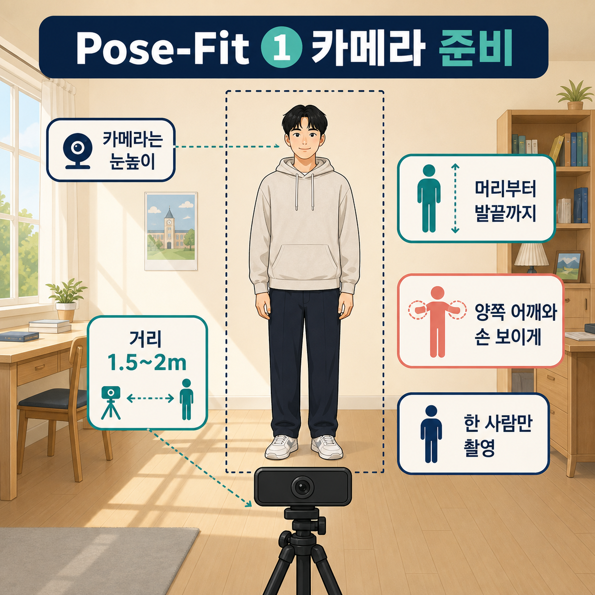
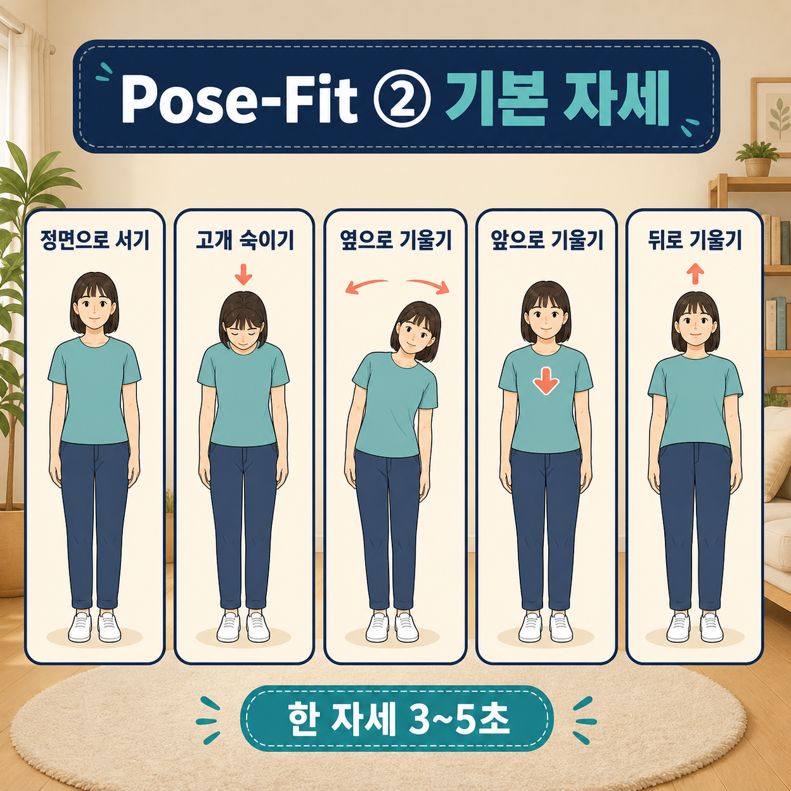
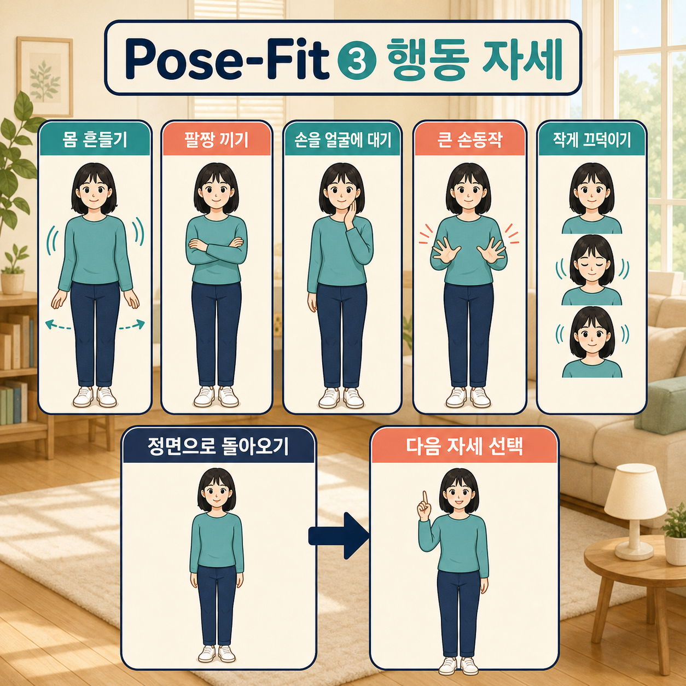

# Pose-Fit 촬영 안내

## 바로 시작

1. 카메라를 참가자 눈높이에 맞춤
2. 카메라와 참가자 사이 1.5~2m 맞춤
3. 화면에 머리부터 발끝, 양쪽 어깨와 손 모두 보이게 맞춤
4. 화면에는 참가자 한 명만 나오게 맞춤
5. 참가자가 카메라 정면을 보고 편하게 선 뒤 촬영 시작

## 한 자세 촬영 순서

1. 촬영할 자세 하나 선택
2. 참가자가 카메라 정면을 보고 편하게 서기
3. “시작” 신호 후 안내 자세만 3~5초 유지
4. 촬영 끝나면 다시 정면 자세로 돌아오기
5. 다음 자세 골라 같은 방법으로 촬영

모든 자세는 카메라 정면으로 촬영. 한 영상에는 자세 하나만 담기. 예: 팔짱 촬영 중 고개
숙이거나 몸 흔들지 않기. 아프거나 어지러우면 바로 중단.

## 촬영 자세와 참가자 안내

### 기본 자세

| 촬영 이름 | 참가자에게 이렇게 말하기 |
| --- | --- |
| 정면으로 편하게 서기 | 카메라 정면 보고 팔 자연스럽게 내린 채 서기 |
| 고개 숙이기 | 눈만 내리지 말고 고개를 살짝 아래로 숙이기 |
| 옆으로 기울기 | 몸통을 왼쪽 또는 오른쪽으로 살짝 기울이기 |
| 앞으로 기울기 | 허리 많이 굽히지 말고 상체만 카메라 쪽으로 살짝 기울이기 |
| 뒤로 기울기 | 넘어지지 않는 범위에서 상체만 카메라 반대쪽으로 살짝 기울이기 |

`옆으로 기울기`는 왼쪽·오른쪽 비슷한 횟수로 촬영.

### 행동 자세

| 촬영 이름 | 참가자에게 이렇게 말하기 |
| --- | --- |
| 몸 흔들기 | 상체를 왼쪽·오른쪽으로 천천히 한 번 이상 움직이기 |
| 팔짱 끼기 | 자연스럽게 팔짱 끼고 서기 |
| 손을 얼굴에 대기 | 손을 볼 또는 턱 근처에 가볍게 대기 |
| 큰 손동작 하기 | 가슴 아래에서 양손을 평소보다 크게 움직이기 |
| 가볍게 끄덕이기 | 카메라 정면 보며 작게 두세 번 끄덕이기 |

## 촬영 횟수

1. 한 사람당 자세 하나를 42번씩 촬영
2. 자세 10개 → 한 사람당 총 420개 촬영
3. 한 사람 촬영 시간 약 85~105분
4. 12명 촬영 → 자세마다 504개, 전체 5,040개

## 촬영 예

1. “팔짱 끼기” 선택
2. 참가자가 카메라 정면으로 서기
3. “시작” 신호 주기
4. 참가자가 팔짱 낀 채 3~5초 유지
5. 촬영 끝나면 참가자가 다시 정면으로 서기
