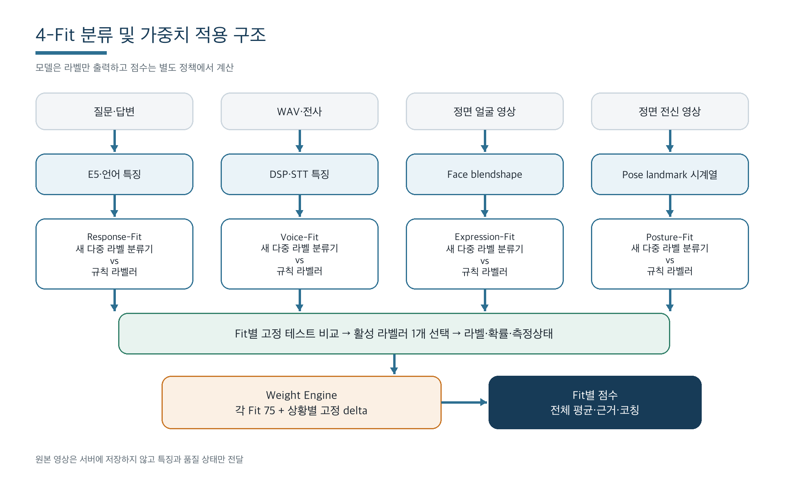
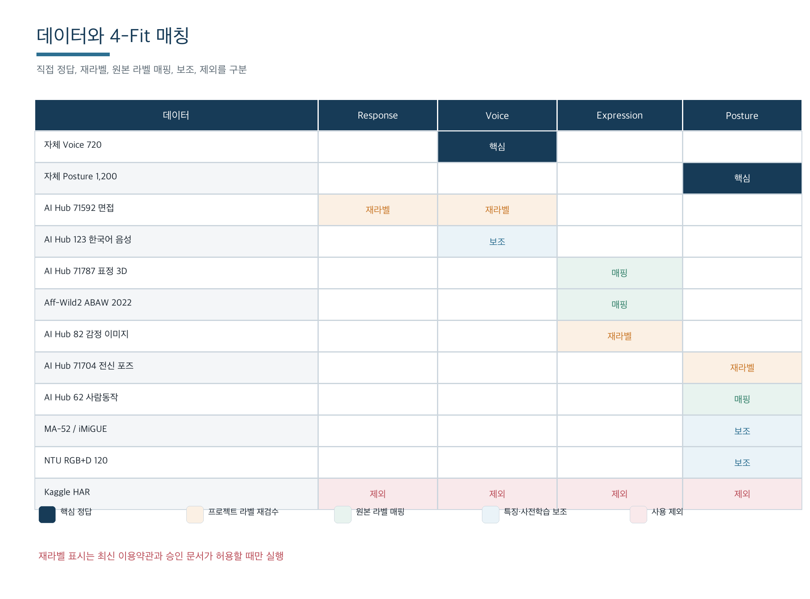
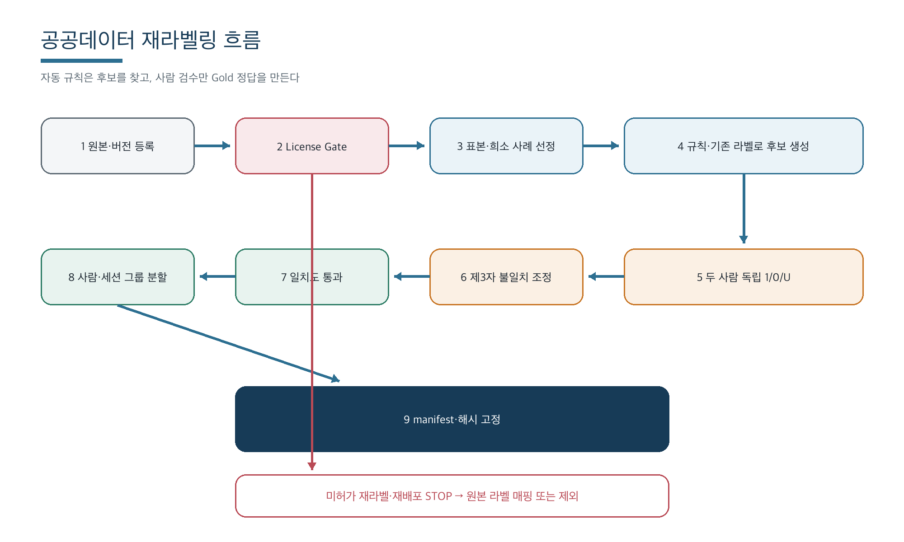
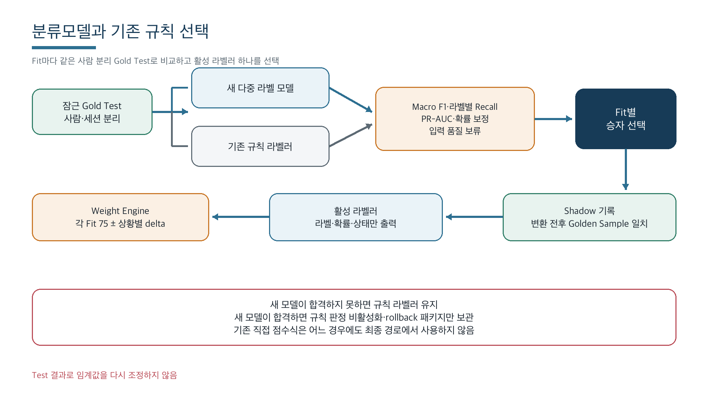

# 4-Fit 분류모델 및 데이터 활용 기획서

문서 버전 1.0  
작성일 2026-09-05  
대상 프로젝트 2026CarpeDM_EXPO  
적용 범위 Response-Fit, Voice-Fit, Expression-Fit, Posture-Fit

## 1 의사결정 요약

이번 개선의 핵심은 4개 AI를 점수 예측 모델이 아니라 라벨 분류기로 만드는 것이다. 각 모델은 관찰된 상태의 라벨과 확률만 반환한다. 기준점 75점에서 라벨별 점수를 더하고 빼는 일은 모델 밖의 버전 관리된 가중치 정책이 담당한다.

기존 규칙은 즉시 삭제하지 않는다. 각 Fit마다 기존 규칙을 같은 라벨을 출력하는 기준선으로 바꾸고, 새 분류모델과 동일한 고정 테스트셋에서 비교한다. 분류모델이 더 좋으면 해당 Fit의 규칙 판정기를 비활성화하고, 규칙이 더 좋으면 규칙 라벨러를 당분간 유지한다. V1은 운영과 설명을 단순하게 유지하기 위해 Fit마다 활성 라벨러를 하나만 선택한다. 어떤 방법이 선택되더라도 기존의 직접 점수 계산식은 최종 경로에서 사용하지 않는다.

초기 구현은 원본 음성·영상을 그대로 학습하는 대형 모델이 아니라 E5, 음성 DSP, MediaPipe 특징을 고정해 사용하고 작은 다중 라벨 분류기를 학습하는 방식으로 한다. 이 방식이 4인 팀, 현재 데이터 규모, Colab과 로컬 CPU 환경에 가장 적합하다.

### 1.1 확정 사항

- 네 모델 모두 점수가 아니라 원자적 다중 라벨과 확률을 출력한다.
- `팔짱+고개 숙임`, `빠른 말+작은 목소리`처럼 여러 상태를 동시에 낼 수 있다.
- `normal`, `neutral_front`, `neutral`은 별도 조합 클래스가 아니라 다른 라벨이 활성화되지 않을 때 계산한다.
- 점수는 `75 + 활성 라벨의 상황별 가중치 합`으로 계산한다.
- 모델 확률을 점수로 직접 환산하지 않는다.
- 새 모델과 기존 규칙은 사람·세션 단위로 분리한 같은 테스트셋에서 비교한다.
- 공공데이터는 이용 조건을 먼저 확인한 뒤 직접 사용, 재라벨링, 보조학습, 제외로 구분한다.
- 표정은 공공데이터만으로 학습할 수 있으나 실제 전시 환경 검증 전에는 점수 가중치를 0으로 둔다.

### 1.2 이번 단계에서 하지 않는 일

- 0~100점을 정답으로 둔 회귀모델 학습
- 여러 상태를 하나로 합친 조합 클래스 생성
- 무작위 파일 또는 프레임 단위 데이터 분할
- 감정 라벨을 답변 품질이나 성격 평가로 해석
- 이용 조건이 금지한 데이터의 재라벨링 또는 재배포
- 대규모 end-to-end Transformer나 영상 모델 학습

## 2 현재 구조와 변경 방향

현재 프로젝트의 Response는 규칙과 E5 의미 유사도를 사용하고, Voice는 음성 DSP 규칙, Posture와 Expression은 MediaPipe 집계값 임계치를 사용한다. 이 결과는 곧바로 0~100점으로 변환되어 총점에 반영된다. 현재 보유한 `response_e5_v1`은 답변 분류기가 아니라 텍스트 임베딩 모델이다.

새 구조에서는 기존 특징 추출기는 최대한 재사용하되, 판정과 점수 계산을 분리한다.

| 구분 | 현재 | 변경 후 |
|---|---|---|
| 모델 책임 | 특징 또는 규칙으로 직접 점수 계산 | 관찰 라벨과 확률만 출력 |
| 기존 규칙 | 최종 점수 생성 | 같은 라벨을 내는 비교 기준선 |
| E5 | 체크리스트 의미 유사도 | Response 분류기의 고정 특징 |
| DSP | Voice 점수식 | Voice 특징 또는 규칙 라벨러 |
| MediaPipe | Posture·Expression 점수식 | 시계열 특징 추출기 |
| 점수 | Fit 내부에서 계산 | 별도 Weight Engine에서 계산 |
| 모델 선택 | 고정 | Fit별 모델 대 규칙 성능 비교 후 선택 |



그림 1. 4-Fit 분류 및 가중치 적용 구조

## 3 공통 출력 계약과 점수 정책

### 3.1 분류 결과 계약

모든 Fit은 같은 형태의 결과를 반환한다. `score`, `delta`, 코칭 문구는 모델 출력에 넣지 않는다.

```json
{
  "contract_version": "4fit.prediction.v1",
  "fit": "posture",
  "status": "ok",
  "label_version": "posture-labels.v1",
  "window": {"start_ms": 1200, "end_ms": 5200},
  "labeler": {
    "type": "model",
    "name": "posture-fit",
    "version": "1.0.0",
    "artifact_sha256": "..."
  },
  "predictions": [
    {
      "label_id": "arms_crossed",
      "probability": 0.91,
      "active": true,
      "threshold": 0.70,
      "evidence": ["wrist_crossing", "elbow_geometry"]
    },
    {
      "label_id": "head_down",
      "probability": 0.83,
      "active": true,
      "threshold": 0.72
    }
  ],
  "quality": {
    "sample_count": 82,
    "calibrated": true,
    "withheld_reasons": []
  }
}
```

신뢰도나 입력 품질이 부족하면 틀린 라벨을 강제로 반환하지 않고 `status: withheld` 또는 `status: not_measured`로 처리한다.

### 3.2 점수 정책

각 Fit은 75점에서 시작하고, 전체 점수는 정상 측정된 Fit 점수의 평균으로 계산한다.

```text
Fit 점수 = clip(75 + Σ 활성 라벨의 상황·단계별 가중치, 0, 100)
전체 점수 = 측정된 Fit 점수의 산술평균
```

모델 확률은 활성 여부를 결정하는 임계값에 사용한다. 보정되지 않은 확률을 점수에 곱하지 않는다. 같은 라벨도 상황과 대화 단계에 따라 가중치가 달라질 수 있다.

| 상황 예시 | Fit | 라벨 | 가중치 예시 | 설명 |
|---|---|---|---:|---|
| 면접 답변 중 | Response | `question_aligned` | +5 | 질문과 직접 연결된 답변 |
| 면접 답변 중 | Response | `risky_phrase` | -8 | 공격적·무책임 표현 |
| 면접 답변 중 | Voice | `fast` | -3 | 지나치게 빠른 발화 |
| 면접 답변 중 | Voice | `intonation_varied` | +2 | 전달을 돕는 높낮이 변화 |
| 상대 발화 청취 중 | Posture | `nod` | +2 | 경청 신호로 해석되는 경우 |
| 본인 답변 중 | Posture | `head_down` | -4 | 장시간 아래를 보는 경우 |
| 모든 단계 | Expression | `smile` | 0 | 검증 완료 전 관찰 전용 |

위 숫자는 구현 구조를 설명하기 위한 초기 예시이며, 실제 가중치는 사용자 평가 실험에서 별도로 보정한다. 정책은 `weights_v1.json`과 같이 버전을 붙여 모델 파일과 독립적으로 관리한다.

## 4 라벨 체계

### 4.1 공통 원칙

- 한 샘플에 각 라벨을 독립적인 0 또는 1 열로 저장한다.
- 서로 함께 나타날 수 있는 상태를 하나의 조합 라벨로 만들지 않는다.
- 사람의 성격이나 감정을 추정하지 않고 관찰 가능한 말과 움직임만 라벨링한다.
- 긍정 또는 부정의 의미는 모델이 아니라 가중치 정책에서 결정한다.
- 정상 상태는 다른 활성 라벨이 없고 입력 품질이 충분할 때만 파생한다.

### 4.2 Response-Fit 라벨

| 라벨 ID | 촬영자·라벨러가 보는 기준 | 점수 방향은 정책에서 결정 |
|---|---|---|
| `question_aligned` | 질문에 직접 답함 | 보통 + |
| `core_covered` | 평가기준의 핵심 내용을 포함함 | 보통 + |
| `conclusion_first` | 결론을 먼저 말함 | 상황별 + |
| `reason_present` | 판단 이유나 근거가 있음 | 보통 + |
| `action_present` | 구체적인 행동이 있음 | 보통 + |
| `deadline_commitment` | 언제까지 할지 말함 | 상황별 + |
| `ownership` | 본인이 책임지고 할 일을 말함 | 보통 + |
| `polite` | 상황에 맞는 존댓말을 사용함 | 보통 + |
| `risky_phrase` | 공격적·무책임·부적절 표현이 있음 | 보통 - |
| `excessive_hedge` | 애매한 회피 표현이 반복됨 | 보통 - |
| `refusal_without_alternative` | 거절만 하고 대안을 제시하지 않음 | 보통 - |
| `filler_present` | 음, 어 같은 군더더기 소리가 반복됨 | 상황별 - |
| `restart_present` | 말을 중단하고 처음부터 다시 말함 | 상황별 - |

`filler_present`와 `restart_present`는 Voice가 아니라 Response의 발화 구성 라벨로 관리한다.

### 4.3 Voice-Fit 라벨

| 라벨 ID | 기준 |
|---|---|
| `fast` | 기준보다 지나치게 빠름 |
| `slow` | 기준보다 지나치게 느림 |
| `mid_pause` | 시작·끝이 아닌 문장 중간에 1.5초 이상 멈춤이 있음 |
| `quiet` | 개인·기기 기준에 비해 작은 목소리 |
| `intonation_varied` | 문장 안에서 음높이와 에너지가 함께 분명히 변함 |
| `normal` | 위 라벨이 없을 때 파생 |

`quiet`는 절대 dBFS만으로 라벨링하지 않는다. 같은 기기·거리 또는 개인의 평소 음량 대비 상대값을 사용한다. `intonation_varied`에는 pitch 변화량과 energy 변화량을 하위 속성으로 따로 기록한다.

### 4.4 Expression-Fit 라벨

| 라벨 ID | 연결 가능한 Action Unit 또는 시간 특징 |
|---|---|
| `smile` | AU6과 AU12 중심 |
| `brow_raise` | AU1과 AU2 중심 |
| `brow_furrow` | AU4 중심 |
| `lip_press` | AU23과 AU24 중심 |
| `expression_change` | 구간 내 표정 특징 변화량 |
| `neutral` | 활성 라벨이 없을 때 파생 |

표정 모델은 긴장, 진정성, 호감도, 성격을 직접 출력하지 않는다. AU와 관찰 가능한 변화만 출력한다.

### 4.5 Posture-Fit 라벨

| 라벨 ID | 기준 |
|---|---|
| `head_down` | 고개를 아래로 숙임 |
| `side_lean` | 상체가 왼쪽 또는 오른쪽으로 기울어짐 |
| `forward_lean` | 상체가 앞으로 기울어짐 |
| `backward_lean` | 상체가 뒤로 기울어짐 |
| `sway` | 일정 구간 동안 몸이 좌우로 반복 이동함 |
| `arms_crossed` | 양팔을 가슴 앞에서 교차함 |
| `hand_to_face` | 손이 얼굴 주변에 머묾 |
| `large_gesture` | 손·팔의 이동 범위가 큼 |
| `nod` | 고개를 위아래로 반복 움직임 |
| `neutral_front` | 위 라벨이 없고 정면 측정 품질이 충분할 때 파생 |

`sway`, `large_gesture`, `nod`는 정지 이미지가 아니라 3~5초 시계열로 판정한다.

## 5 Fit별 모델 설계

### 5.1 Response-Fit

- 입력: `scenario_id`, 질문, 답변, 평가기준, 대화 단계
- 특징: 기존 E5 질문·답변·평가기준 임베딩, 질문-답변 유사도, 답변 길이, 핵심 표현, 위험 표현, 존댓말, 결론 위치
- V1 모델: 라벨별 독립 Logistic Regression을 묶은 One-vs-Rest 다중 라벨 분류기
- `question_aligned`: 질문·답변 쌍을 입력으로 판정
- `core_covered`: `(질문, 답변, 체크리스트 항목)` 쌍의 충족 여부를 먼저 판정한 뒤 항목 결과를 집계
- 확장 조건: V1의 오분류가 문맥 이해 한계로 확인될 때만 작은 MLP 또는 소형 한국어 encoder를 비교
- 기존 규칙: 체크리스트·정규식·E5 임계값을 같은 라벨 계약으로 변환한 기준선
- 특별 분할: 같은 질문, 같은 시나리오, 문장 변형이 학습과 테스트에 동시에 들어가지 않게 그룹 분할

### 5.2 Voice-Fit

- 입력: 16 kHz mono WAV와 STT 전사문
- 특징: 음절/초, 유성 발화 시간, 내부 침묵 길이와 비율, 상대 RMS, F0 범위와 변동, 에너지 변동
- V1 모델: 표준화된 특징의 다중 라벨 Logistic Regression 또는 Random Forest
- 기존 규칙: 현재 DSP 임계치를 같은 라벨로 변환한 기준선
- 특별 처리: `mid_pause`는 시작·끝 무음이 아닌 문장 내부 무음만 측정
- 특별 처리: `quiet`는 녹음 기기와 거리의 영향을 제거하도록 개인 또는 세션 기준 상대 음량 사용

### 5.3 Expression-Fit

- 입력: 정면 얼굴 영상에서 MediaPipe Face Landmarker가 만든 blendshape 시계열
- 특징: AU 대응 blendshape, 지속시간, 동시 발생, 변화량, 얼굴 검출 품질
- V1 모델: 독립 sigmoid 출력의 Logistic Regression 또는 작은 MLP
- 기존 규칙: 기존 고정 임계치를 같은 관찰 라벨로 변환한 기준선
- 공공데이터: AI Hub 71787과 Aff-Wild2의 AU 라벨을 중심으로 사용. 공공 이미지·영상에도 오프라인으로 같은 MediaPipe 특징 추출기를 적용해 학습 입력과 서비스 입력을 맞춤
- 운영 원칙: 실제 부스 카메라 검증 전에는 `Expression` 가중치를 0으로 유지

현재 MVP의 Face Tracking 설정은 blendshape 출력을 사용하지 않으므로, 모델 연결 전에 `outputFaceBlendshapes`와 데이터 계약을 먼저 활성화하고 측정 누락 상태를 검증해야 한다.

### 5.4 Posture-Fit

- 입력: 정면 3~5초 영상에서 MediaPipe Pose가 만든 3D landmark 시계열
- 전처리: 골반 중심 원점 이동, 어깨너비 기준 크기 정규화, 좌표 결측 마스킹, 일정 길이 resampling
- 특징: 머리·어깨·상체 각도, 손목과 얼굴·가슴 거리, 이동 속도와 범위, 방향 전환 횟수
- V1 모델: 정규화된 통계·시계열 특징의 Logistic Regression 또는 Random Forest
- 기존 규칙: 현재 각도와 이동 임계치를 같은 라벨로 변환한 기준선
- 확장 조건: `sway`, `nod`, `large_gesture`의 V1 성능이 부족할 때만 temporal MLP나 1D TCN 비교

## 6 데이터 활용 전략

공공데이터는 많이 확보하는 것보다 프로젝트 라벨과 도메인에 맞게 쓰는 것이 중요하다. 다음 네 등급으로 구분한다.

1. 직접 또는 라벨 매핑 사용: 기존 라벨이 프로젝트 관찰 라벨과 직접 연결됨
2. 재라벨링 사용: 원본 모달리티는 맞지만 프로젝트 라벨을 새로 붙여야 함
3. 보조학습 사용: 특징 추출기, 음성 분포, 키포인트 안정화 등에만 사용
4. 제외: 라벨, 시간축, 권리 조건이 목적과 맞지 않음



그림 2. 자체 수집 데이터와 공공데이터의 Fit별 사용 방식

### 6.1 전체 데이터 매칭표

| 데이터 | Response | Voice | Expression | Posture | 최종 사용 방식 |
|---|---|---|---|---|---|
| 자체 Voice 720개 | - | 핵심 정답 | - | - | 사람 분리 학습·검증·테스트 |
| 자체 Posture 1,200개 | - | - | - | 핵심 정답 | 사람 분리 학습·검증·테스트 |
| AI Hub 71592 채용면접 인터뷰 | 재라벨 핵심 | 재라벨 보조 | - | - | Q/A 1,500건, 음성 1,200건 파일럿 |
| AI Hub 123 한국어 음성 | - | 약한 라벨 보조 | - | - | 속도·F0 분포와 ASR 보조 |
| AI Hub 71787 시나리오 기반 표정 3D | - | - | AU 매핑 핵심 | - | JPEG·AU에서 균형 표본 사용 |
| Aff-Wild2 | - | - | AU·시간축 핵심 | - | EULA 승인 후 구간 학습 |
| AI Hub 82 한국인 감정인식 복합 영상 | - | - | 조건부 재라벨 | - | 감정은 버리고 표정 관찰 라벨만 새로 검수 |
| AI Hub 71704 한국인 전신 및 포즈 | - | - | - | 조건부 재라벨 | 정지 자세·키포인트 보조, 동작 라벨 제외 |
| AI Hub 62 사람동작 영상 | - | - | - | 원본 라벨 매핑 | `팔짱끼기` 중심 보조 |
| MA-52 | - | - | - | 보조 | 원본 micro-action 라벨만 매핑 |
| iMiGUE | - | - | - | 조건부 보조 | 접근 조건 확인 후 특징 검증 |
| NTU RGB+D 120 | - | - | - | 보조 | 원본 액션·skeleton 매핑만 사용 |
| Kaggle HAR 정지 이미지 | - | - | - | 제외 | 라벨·시간축 불일치 및 이미지 권리 불명확 |

### 6.2 Response 데이터 계획

AI Hub 71592는 면접 질문과 답변, 전사, 직군·경력·면접 형식 메타데이터가 있어 Response에 가장 가깝다. 다만 제공되는 긍정·부정·중립 감정은 답변 품질 라벨이 아니므로 사용하지 않는다.

초기 파일럿은 질문과 답변 1,500건을 뽑아 13개 프로젝트 라벨을 새로 붙인다. 라벨은 서로 겹칠 수 있으므로 각 라벨의 양성 샘플이 최소 100건 이상 되도록 희소 라벨을 추가 표집한다. 한 행에는 답변만 저장하지 않고 질문, 답변, 상황, 직무, 청자 관계, 원본 그룹 ID를 함께 저장한다.

### 6.3 Voice 데이터 계획

자체 720개를 최종 정답 데이터로 사용한다. 12명 × 6상태 × 10개이며, 8명 학습, 2명 검증, 2명 테스트로 나눈다. 공공데이터는 다양한 한국어 발화와 면접 환경을 보완한다.

AI Hub 71592의 답변 음성에서 속도, 내부 멈춤, 상대 음량, F0와 에너지 변화량을 계산해 후보를 뽑고 사람이 듣고 확인한다. 파일럿은 최대 1,200개의 검수 완료 구간으로 제한한다. AI Hub 123은 자연 대화 분포와 ASR 보조에 사용하되, 발화가 긴 침묵 기준으로 잘린 특성 때문에 `mid_pause` 정답으로 쓰지 않는다. 서로 다른 기기의 절대 음량만으로 `quiet`를 만들지 않는다.

### 6.4 Expression 데이터 계획

자체 학습 영상은 만들지 않고 공공데이터를 사용한다. AI Hub 71787은 2,500명의 51개 표정, 127,500세트, Action Unit 라벨을 포함하므로 한국인 얼굴과 프로젝트 관찰 라벨을 연결하기 좋다. 전체 중 사람·AU 균형을 맞춘 최대 20,000개 JPEG 표본을 1차 학습에 사용한다.

Aff-Wild2는 약 3백만 프레임의 영상과 AU·표정·valence/arousal 라벨이 있어 `expression_change` 같은 시간축 학습을 보완할 수 있다. 버전별 AU 구성이 다르므로 이번 계획에서는 AU23·AU24를 포함하는 **ABAW 2022 12-AU track**을 고정한다. 접근 승인을 받고 EULA 범위에서만 사용한다. AI Hub 82의 감정 7종 라벨은 직접 쓰지 않고, 조명·장소 다양성이 필요한 경우 최대 2,000장을 뽑아 AU형 관찰 라벨을 새로 검수한다.

공공데이터만으로 학습할 경우 실제 부스 카메라, 거리, 조명에서의 성능을 증명할 수 없다. 별도 검증이 완료되기 전까지 Expression 결과는 화면에 관찰 정보로만 표시하고 점수 가중치는 0으로 둔다.

### 6.5 Posture 데이터 계획

자체 1,200개를 최종 정답 데이터로 사용한다. 12명 × 10자세 × 10개이며 전부 정면 3~5초 영상이다. 8명 학습, 2명 검증, 2명 테스트로 나눈다.

AI Hub 71704는 1,800명의 멀티뷰 전신 이미지 43,200개와 키포인트·세그멘테이션이 있어 정지 자세의 키포인트 안정화와 조건부 재라벨링에 사용할 수 있다. `head_down`, `side_lean`, `forward_lean`, `backward_lean`, `arms_crossed`, `hand_to_face` 후보만 사용하고, 시간축이 필요한 `sway`, `large_gesture`, `nod`에는 사용하지 않는다.

AI Hub 62는 5~10초 사람동작 영상 20만 클립과 50개 동작 라벨을 제공하며 `팔짱끼기`가 포함되어 있다. 원본 `팔짱끼기` 라벨을 `arms_crossed` 보조 데이터로 매핑하고 비슷한 촬영 조건의 음성 없는 동작을 음성·표정과 분리해 사용한다.

MA-52, iMiGUE, NTU RGB+D는 미세 동작과 skeleton 표현을 검증하는 보조 후보이다. 원본 이용 조건이 재라벨링이나 파생 데이터 생성을 금지하는 경우 새 라벨 파일을 만들어 공유하지 않고 원본 라벨 매핑 또는 특징 추출 검증에만 사용한다.

## 7 공공데이터 재라벨링 설계

공공데이터를 새로 라벨링하는 방법은 이번 프로젝트에 적합하다. 특히 Response는 도메인은 가깝지만 원하는 품질 라벨이 없고, Voice·Posture·Expression은 일부 관찰 라벨만 맞기 때문이다. 다만 재라벨링은 데이터 이용약관이 내부 파생 주석 생성을 허용하는 경우에만 진행한다.



그림 3. 공공데이터 접근 확인부터 고정 데이터셋 생성까지의 절차

### 7.1 재라벨링 절차

1. 데이터셋별 이용약관, 승인 계정, 상업 이용, 재라벨링, 파생 모델 반출, 재배포 가능 여부를 기록한다.
2. 원본 전체를 라벨링하지 않고 목표 라벨 후보와 경계 사례를 먼저 추린다.
3. 기존 규칙 또는 기존 주석으로 후보 라벨을 자동 제안한다. 이 값은 정답이 아니다.
4. 두 사람이 서로의 결과를 보지 않고 각 라벨을 0 또는 1로 표시한다.
5. 두 결과가 다르면 정의서와 원본을 보고 조정한다. 애매하면 `uncertain`으로 제외한다.
6. 라벨별 Cohen kappa 또는 Krippendorff alpha를 계산한다. 0.67 미만이면 정의를 고치고 다시 라벨링하며, 0.80 이상을 목표로 한다.
7. 사람, 세션, 원본 영상, 질문 그룹 기준으로 학습·검증·테스트를 먼저 고정한다.
8. 파일 해시, 원본 ID, 라벨러 버전, 분할 정보를 manifest로 고정한다.
9. 제한 데이터의 원본과 파생 라벨은 승인받지 않은 공유 드라이브나 GitHub에 올리지 않는다.

### 7.2 공통 라벨 파일 예시

```csv
sample_id,source_dataset,source_group_id,participant_id,session_id,fit,split,label_version,question_aligned,fast,quiet,arms_crossed,head_down,annotator_a,annotator_b,adjudicated,license_record_id
```

사용하지 않는 Fit의 라벨 열은 비워 두고, 한 샘플에 여러 라벨을 동시에 1로 둘 수 있다. 파일명이나 프레임 번호가 아니라 원본 사람·세션·영상 ID를 보존해야 누수를 막을 수 있다.

### 7.3 데이터별 재라벨링 허용 범위

| 데이터 | 권장 작업 | 금지 또는 주의 |
|---|---|---|
| AI Hub 71592·123·71787·71704·82·62 | 승인과 이용정책 확인 후 내부 학습용 재라벨 또는 원본 라벨 매핑 | 원본·라벨링 파일을 승인받지 않은 사람에게 공유하지 않음 |
| Aff-Wild2 | EULA 승인 후 조직 내부 AU 매핑과 학습 | 원본·공식 주석·파생 주석 공개 배포 금지 |
| MA-52 | 원본 라벨을 프로젝트 라벨과 코드상 매핑 | 안내문상 재주석·재배포 금지, 별도 서면 허가 없이는 새 라벨 파일 생성 금지 |
| NTU RGB+D | 원본 action·skeleton 라벨 매핑 | 허가 없이 파생 데이터셋 생성·재배포 금지 |
| iMiGUE | 접근 승인과 최신 조건을 확인한 뒤 보조 실험 | 조건 확인 전 재라벨링 보류 |
| Kaggle HAR | 사용하지 않음 | 개별 이미지 권리와 목표 라벨 불일치 |

법률 해석이 필요한 경우 이 표만으로 단정하지 말고 각 데이터의 최신 이용약관과 승인 메일을 우선한다.

### 7.4 4인 재라벨링 파일럿

본 학습 라벨링 전에 고유 샘플 1,080개로 정의가 실제로 일치하는지 확인한다.

| Fit | 파일럿 고유 샘플 | 목적 |
|---|---:|---|
| Response | 300 | 질문·답변 품질 라벨 경계 확인 |
| Voice | 240 | 71592 180개와 123 60개 후보 검수 |
| Expression | 240 | AU 매핑과 MediaPipe 특징 일치 확인 |
| Posture | 300 | 원본 라벨 매핑과 자세 경계 확인 |

각 Fit의 첫 60개는 네 명이 모두 독립 판정한다. 나머지는 최소 두 명이 보게 순환 배정하며, Validation과 Test 후보는 전부 두 명 독립 라벨과 제3자 불일치 조정을 거친다. 자동 규칙이나 기존 모델의 라벨은 후보 선별에만 사용하고 Test 정답에는 사용하지 않는다. 적용할 라벨이 아닌 항목은 0이 아니라 `N/A`, 판단할 수 없는 항목은 `U`로 저장해 loss에서 제외한다.

## 8 데이터 분할과 조합 검증

Voice와 Posture 자체 데이터는 12명을 다음처럼 고정한다.

| 분할 | 인원 | Voice 전체 | Posture 전체 | 라벨별 샘플 | 목적 |
|---|---:|---:|---:|---:|---|
| Train | 8명 | 480개 | 800개 | 80개 | 모델 학습 |
| Validation | 2명 | 120개 | 200개 | 20개 | 임계값·모델 선택 |
| Test | 2명 | 120개 | 200개 | 20개 | 최종 1회 평가 |

원본 영상에서 여러 프레임을 뽑아도 전부 같은 분할에 두고, 프레임 수를 독립 샘플 수로 세지 않는다. Response는 같은 질문·시나리오·문장 변형을 같은 그룹으로 묶는다. Expression 공공데이터도 인물 기준으로 분할한다. Test 참가자가 2명뿐이므로 결과는 PoC 성능으로 표기하고, 배포 전에는 미참여자를 추가한 잠금 테스트 또는 grouped cross-validation으로 불확실성을 확인한다.

현재 Voice와 Posture 촬영은 한 샘플에 한 상태만 넣도록 설계되어 있다. 이 데이터는 기본 분류기 학습에 사용하고, 실제 다중 라벨 동시 검출 확인을 위해 학습과 분리된 소량의 조합 검증 세트를 추가한다. 조합 자체를 새 클래스 이름으로 만들지는 않는다.

조합 검증 예시는 `fast+quiet`, `slow+mid_pause`, `arms_crossed+head_down`, `hand_to_face+side_lean`이다. 조합 검증 세트는 임계값과 후처리 충돌을 확인하기 위한 것이며, 각 조합의 점수는 활성된 원자 라벨 가중치의 합으로 계산한다.

## 9 학습과 모델 선택



그림 4. 같은 고정 테스트셋에서 새 모델과 규칙 라벨러를 비교하는 절차

### 9.1 학습 순서

1. 영문 라벨 ID, 정의서, 데이터 스키마를 먼저 동결한다.
2. 사람·세션·질문 그룹 기준으로 분할을 고정한다.
3. 기존 규칙을 라벨러로 바꾸고 기준선 결과를 저장한다.
4. Train으로 작은 분류기를 학습한다.
5. Validation에서 모델 종류와 라벨별 임계값을 결정하고 확률을 보정한다.
6. 잠근 Test에서 모델과 규칙을 각각 한 번 평가한다.
7. Fit별 합격 조건과 상대 성능을 보고 활성 라벨러를 하나 선택한다.
8. Colab과 프로젝트가 같은 샘플에서 같은 결과를 내는지 확인한다.
9. Shadow mode로 기록만 한 뒤 문제 없을 때 활성화한다.

### 9.2 평가 지표와 합격 조건

Accuracy만으로 모델을 고르지 않는다. Macro F1을 주 지표로 하고 라벨별 Precision, Recall, F1, PR-AUC, 혼동행렬을 함께 본다.

초기 합격 조건은 다음과 같다.

- Macro F1 0.75 이상
- 우선 라벨의 Recall 0.60 이상
- 규칙 기준선보다 Macro F1이 0.03 이상 높거나, 핵심 라벨 개선이 명확하고 다른 라벨이 퇴보하지 않음
- Colab 내보내기 전후 같은 샘플의 라벨과 확률 차이가 허용 범위 이내
- 입력 품질이 나쁠 때 `withheld` 또는 `not_measured`가 정상 동작

합격하지 못한 Fit은 규칙 라벨러를 유지하고 새 모델은 비활성화한다. 합격한 Fit은 새 모델을 활성화하고 기존 규칙 라벨러는 rollback용 패키지로만 보관한다. 기존의 직접 점수 산식은 선택 결과와 관계없이 사용하지 않는다.

### 9.3 점수 엔진 테스트

- 기준점이 75에서 시작하는지 확인
- 복수 라벨의 가중치가 빠짐없이 합산되는지 확인
- 낮은 확률 라벨이 임계값 아래에서 무시되는지 확인
- 같은 사건의 중복 감점이 방지되는지 확인
- 같은 라벨이 말하기·듣기 단계에서 다른 가중치를 받는지 확인
- 같은 라벨·같은 turn이 중복 적용되지 않고 적용 횟수 상한을 지키는지 확인
- 결과에 `policy_version`과 적용 근거 audit trail이 남는지 확인
- Expression 가중치 0 정책이 검증 전 유지되는지 확인
- 모든 결과가 0~100 범위로 잘리는지 확인

## 10 배포 설계

브라우저의 MediaPipe 처리 방식은 유지한다. 원본 영상은 서버로 보내지 않고 정규화된 특징과 품질 정보만 전달한다. FastAPI에는 Fit별 labeler adapter와 공통 Weight Engine을 둔다.

```text
backend/models/4fit/
├── active_models.json
├── response/1.0.0/
├── voice/1.0.0/
├── expression/1.0.0/
└── posture/1.0.0/
    ├── manifest.json
    ├── model.onnx
    ├── labels.json
    ├── feature_schema.json
    ├── thresholds.json
    ├── metrics.json
    └── SHA256SUMS
```

V1 실험은 scikit-learn으로 진행하고 최종 배포본은 가능하면 ONNX로 내보낸다. `joblib` 또는 pickle은 라이브러리 버전 종속성과 임의 코드 실행 위험이 있으므로 실험용으로만 사용한다. Response는 기존 E5 safetensors를 encoder로 유지하고 작은 분류 head를 추가한다.

`active_models.json`에는 Fit별 활성 labeler 유형, 버전, 해시, fallback 버전을 기록한다. Weight Policy는 모델 디렉터리 밖에서 별도 버전으로 관리한다.

## 11 4인 역할 분담

| 담당 | 소유 범위 | 공통 제출물 |
|---|---|---|
| 1인 Response | 71592 재라벨, E5 특징, Response 분류기 | 모델, 라벨표, 전처리, 지표, 모델 카드 |
| 1인 Voice | 720개 자체 음성, 공공 음성 후보, DSP 특징 | 모델, 라벨표, 전처리, 지표, 모델 카드 |
| 1인 Expression | 71787·Aff-Wild2 AU 매핑, Face 특징 | 모델, 라벨표, 전처리, 지표, 모델 카드 |
| 1인 Posture | 1,200개 자체 영상, 공공 Pose 매핑 | 모델, 라벨표, 전처리, 지표, 모델 카드 |

각 담당자는 자기 Fit을 개발하지만, 데이터 분할·공통 계약·평가 코드는 서로 교차 검토한다. 한 사람이 모델을 학습하고 다른 사람이 테스트셋 누수와 지표를 확인한다.

## 12 4주 실행 계획

4주 일정은 네 명이 각 Fit을 병렬로 개발하고 1주차부터 네 모델을 모두 학습하는 방식으로 진행한다. 1주차 V0 모델은 성능 확정본이 아니라 전처리부터 평가까지 전체 코드가 동작하는지 확인하는 파이프라인 점검용 결과물이다. 이후 수집·재라벨링 데이터가 늘어날 때마다 V1과 V2로 다시 학습한다. 이용 승인이 끝나지 않은 공공데이터는 V0에도 넣지 않고, 허가된 표본이나 자체 pilot만 사용한다.

| 주차 | 목표 | 완료 기준 |
|---|---|---|
| 1주차 | 라벨·스키마·이용 조건 확정, 4개 Fit V0 학습, 공통 prediction contract 구현 | 라벨 정의서·후보 ID·공통 출력 형식 고정, Fit별 V0와 첫 Validation 지표 확보 |
| 2주차 | 자체 수집·재라벨링·특징 추출, V1 재학습, adapter·WeightEngine 골격 연결 | QC 통과 데이터·feature cache·V1 지표, API·저장 구조 smoke test 확보 |
| 3주차 | V2 학습, Validation에서 모델·임계값 확정, 동결 후 고정 Test 1회와 조합 검증 | Test 지표와 오류 사례 확보, Fit별 활성 labeler 후보 결정 |
| 4주차 | 최종 모델 선택, ONNX 패키지 교체, parity·shadow·rollback 검증 | Fit별 활성 labeler 확정, 변환 전후 일치와 운영 기록 확인 |

### 12.1 모델별 개발 일정

각 담당자는 1주차에 적은 양의 데이터로 V0 모델을 먼저 만들고, 같은 전처리와 평가 코드를 유지한 채 데이터만 늘려 V1과 V2를 학습한다. 데이터가 완성될 때까지 학습을 미루지 않고 매주 모델·라벨표·지표·오류 사례를 함께 갱신한다. 라벨 정의가 바뀌면 `label_version`을 올리고 이전 데이터도 새 정의로 다시 확인한다.

#### Response Fit

| 주차 | 개발 작업 | 주간 산출물 |
|---|---|---|
| 1주차 | 13개 라벨 pilot 정의, 71592의 허가된 표본 300건 중 양성이 있는 라벨만 V0 학습, `core_covered` item-pair head 분리 | 라벨 정의서, 그룹 분할표, V0 동작 확인 결과와 미지원 희소 라벨 목록 |
| 2주차 | 라벨별 양성·음성 수와 합의도를 보며 재라벨 확대, 임계값 조정, V1 재학습 | 재라벨 진행표, V1 Macro F1·라벨별 Recall·합의도 |
| 3주차 | 최대 1,500건 검수, Validation에서 두 head와 임계값 확정, 동결 후 고정 Test·규칙 비교 1회 | V2 모델, 오류 분석표, 활성 labeler 후보와 미달 라벨 목록 |
| 4주차 | answer head와 item-pair head 패키징, FastAPI adapter 교체, golden sample·shadow 검증 | manifest·labels·feature schema·thresholds, 변환 일치 기록 |

#### Voice Fit

| 주차 | 개발 작업 | 주간 산출물 |
|---|---|---|
| 1주차 | 5개 원자 라벨과 파생 normal 정의, 허가된 공공 표본·우선 녹음에서 DSP 특징 추출, V0 학습 | 라벨 정의서, 음성 품질 기준, V0 동작 확인 결과와 오류 사례 |
| 2주차 | QC 통과 자체 음성 720개·메타데이터·사람 분할 확보, V1 재학습 | split manifest, feature cache, V1 라벨별 지표 |
| 3주차 | Validation에서 V2·임계값 확정, 동결 후 Test 1회, fast+quiet 조합과 상대 음량 검증 | V2 혼동행렬, grouped CV·bootstrap 구간, PoC 활성 후보 |
| 4주차 | ONNX 패키지 교체, 음성 adapter·golden sample·shadow 검증 | 모델 패키지, 변환 일치 기록, rollback 버전 |

#### Expression Fit

| 주차 | 개발 작업 | 주간 산출물 |
|---|---|---|
| 1주차 | AU 매핑 확정, 허가된 71787 표본으로 직접 매핑 가능한 4개 라벨 V0 학습, `outputFaceBlendshapes` 입력 확인 | AU 매핑표, 인물 분할표, V0 동작 확인 결과와 입력 계약 |
| 2주차 | 71787 균형 표본 확대, Aff-Wild2 시간축과 `expression_change` 연결, V1 재학습 | feature cache, V1 Macro F1·라벨별 Recall |
| 3주차 | Validation에서 V2·임계값 확정, 동결 후 인물 분리 Test 1회, 실제 부스 환경 소량 검증 | V2 모델, 환경별 오류 분석, 관찰 전용 판정 |
| 4주차 | ONNX 패키지 교체, Face adapter·shadow 검증 | 모델 패키지, 변환 일치 기록, 관찰 전용·가중치 0 확인 |

#### Posture Fit

| 주차 | 개발 작업 | 주간 산출물 |
|---|---|---|
| 1주차 | 9개 원자 라벨과 파생 neutral_front 정의, 각 자세를 최소 2명이 찍은 정면 3~5초 pilot으로 Pose 특징 추출·V0 학습 | 라벨 정의서, landmark schema, V0 동작 확인 결과와 오류 사례 |
| 2주차 | QC 통과 자체 영상 1,200개·landmark cache·split manifest 확보, 62·71704 매핑, V1 재학습 | 분할 manifest, feature cache, V1 라벨별 지표 |
| 3주차 | Validation에서 V2·임계값 확정, 동결 후 Test 1회, 별도 조합과 nod·sway·large_gesture 시간축 검증 | V2 혼동행렬, grouped CV·PoC 활성 후보 |
| 4주차 | ONNX 패키지 교체, 정면 Pose adapter·golden sample·shadow 검증 | 모델 패키지, 변환 일치 기록, rollback 버전 |

매주 한 명을 순환 통합 담당자로 지정한다. 통합 담당자는 공통 prediction contract, feature schema, 저장 구조, WeightEngine 테스트와 golden sample을 관리해 4주차 병목을 줄인다.

## 13 위험과 대응

| 위험 | 영향 | 대응 |
|---|---|---|
| 같은 사람이 Train과 Test에 섞임 | 성능 과대평가 | participant_id 그룹 분할 |
| 같은 영상 프레임이 여러 분할에 섞임 | 사실상 정답 유출 | source_group_id 고정 |
| 공공 라벨과 프로젝트 라벨 불일치 | 잘못된 학습 목표 | 직접, 재라벨, 보조, 제외 구분 |
| 공공데이터와 부스 환경 차이 | 현장 성능 하락 | 자체 Voice·Posture Test, Expression 가중치 0 |
| Voice 절대 음량 사용 | 기기마다 다른 판정 | 개인·세션 상대 음량 |
| 정지 이미지로 동작 라벨 학습 | nod·sway 오판 | 시간 구간 특징 사용 |
| 모델 확률과 점수 혼용 | 근거 없는 점수 | 별도 Weight Engine 유지 |
| Colab과 프로젝트 전처리 차이 | 배포 성능 붕괴 | feature_schema와 golden sample 검증 |
| 제한 데이터 재배포 | 이용약관 위반 | access log, 승인자 한정 보관, 원본 미공유 |

## 14 최종 권고

첫 구현은 다음 조합으로 진행한다.

- Response: AI Hub 71592 재라벨 1,500건 + 기존 E5 특징 + One-vs-Rest Logistic Regression
- Voice: 자체 720개 핵심 + AI Hub 71592 검수 음성 최대 1,200개 + DSP 특징 분류기
- Expression: AI Hub 71787 AU 표본 최대 20,000개 + Aff-Wild2 시간축 보조 + 검증 전 가중치 0
- Posture: 자체 1,200개 핵심 + AI Hub 62의 팔짱 원본 라벨 + AI Hub 71704 정지 자세 보조
- 공통: 기존 규칙을 같은 라벨 기준선으로 변환하고 Fit별 승자를 활성화
- 점수: 모델 밖 정책에서 기준 75점에 상황별 라벨 가중치를 더하고 뺌

가장 먼저 해야 할 일은 더 많은 데이터를 내려받는 것이 아니라 13개 Response, 5개 Voice, 5개 Expression, 9개 Posture 원자 라벨의 정의와 `source_group_id`가 포함된 데이터 스키마를 동결하는 것이다. 그 다음에 이용 조건이 허용하는 데이터만 표본으로 가져와 재라벨링해야 한다.

## 15 출처와 확인 링크

확인 기준일은 2026-09-05이다. 데이터 규모와 이용 조건은 실제 신청 시 최신 페이지와 승인 문서를 다시 확인한다.

1. AI Hub 채용면접 인터뷰 데이터 71592  
   https://aihub.or.kr/aihubdata/data/view.do?dataSetSn=71592
2. AI Hub 한국어 음성 데이터 123  
   https://aihub.or.kr/aihubdata/data/view.do?dataSetSn=123
3. AI Hub 시나리오 기반 표정 3D 데이터 71787  
   https://aihub.or.kr/aihubdata/data/view.do?dataSetSn=71787
4. AI Hub 한국인 전신 및 포즈 데이터 71704  
   https://aihub.or.kr/aihubdata/data/view.do?dataSetSn=71704
5. AI Hub 한국인 감정인식을 위한 복합 영상 82  
   https://aihub.or.kr/aihubdata/data/view.do?dataSetSn=82
6. AI Hub 사람동작 영상 62  
   https://aihub.or.kr/aihubdata/data/view.do?dataSetSn=62
7. AI Hub 이용정책  
   https://aihub.or.kr/intrcn/guid/usagepolicy.do?currMenu=151&topMenu=105
8. Aff-Wild2 공식 페이지  
   https://sites.google.com/view/dimitrioskollias/databases/aff-wild2
   ABAW 2022 12-AU track 참고  
   https://openaccess.thecvf.com/content/CVPR2022W/ABAW/papers/Jiang_Model_Level_Ensemble_for_Facial_Action_Unit_Recognition_at_the_CVPRW_2022_paper.pdf
9. MA-52 공식 저장소  
   https://github.com/VUT-HFUT/Micro-Action
10. iMiGUE 논문  
    https://openaccess.thecvf.com/content/CVPR2021/html/Liu_iMiGUE_An_Identity-Free_Video_Dataset_for_Micro-Gesture_Understanding_and_Emotion_CVPR_2021_paper.html
11. NTU RGB+D 공식 페이지  
    https://rose1.ntu.edu.sg/dataset/actionRecognition/
12. Kaggle Human Action Recognition  
    https://www.kaggle.com/datasets/meetnagadia/human-action-recognition-har-dataset
13. scikit-learn OneVsRestClassifier  
    https://scikit-learn.org/stable/modules/generated/sklearn.multiclass.OneVsRestClassifier.html
14. ONNX Runtime Python 시작 안내  
    https://onnxruntime.ai/docs/get-started/with-python.html
