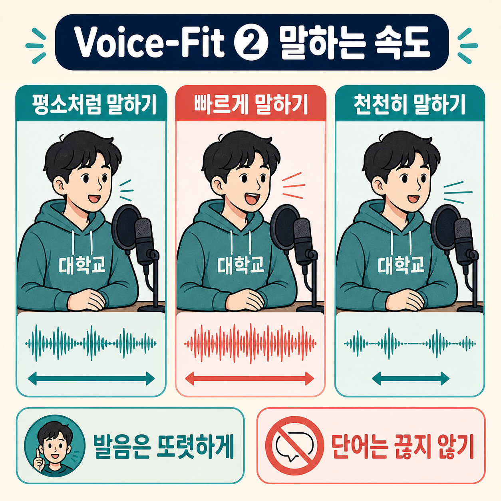

# Voice-Fit 수집 안내

## 바로 시작

1. 조용한 곳에서 녹음
2. 마이크와 입 사이를 손 한 뼘 정도로 맞춤
3. 문장 하나와 목소리 상태 하나 선택
4. 고른 방식으로 문장 한 번 읽기
5. 다음 샘플에서는 다른 문장 또는 목소리 상태 선택

한 번 읽을 땐 목소리 상태 하나만 담기. 예: 빠르게 말하는 샘플과 중간에 멈추는 샘플을
한 번에 섞지 않기.

## 읽을 문장

아래 네 문장을 골고루 사용.

1. “현재 상황을 확인한 뒤 오후 세 시까지 다시 공유드리겠습니다.”
2. “불편을 드려 죄송합니다. 우선 원인을 확인하겠습니다.”
3. “대안을 정리해서 오늘 안에 말씀드리겠습니다.”
4. “제가 담당자와 확인하고 진행 상황을 알려드리겠습니다.”

## 한 문장 녹음 순서

1. 목소리 상태와 문장 하나씩 선택
2. 참가자에게 읽는 방법 짧게 안내
3. 1초 준비 후 문장을 처음부터 끝까지 한 번 읽기
4. 다음 문장 또는 다음 목소리 상태 선택

## 말하는 속도

| 수집 이름 | 참가자에게 이렇게 말하기 |
| --- | --- |
| 평소처럼 말하기 | 평소 대화 속도로 편하게 읽기 |
| 빠르게 말하기 | 발음이 뭉개지지 않게 평소보다 빠르게 읽기 |
| 천천히 말하기 | 단어를 끊지 않고 평소보다 천천히 읽기 |

## 멈춤과 목소리

| 수집 이름 | 참가자에게 이렇게 말하기 |
| --- | --- |
| 중간에 멈추기 | 문장 중간에서 약 1.5초 멈췄다가 이어 읽기 |
| 작은 목소리 | 속삭이지 않고 들리는 정도로 평소보다 작게 읽기 |
| 목소리 변화 | 목에 힘주지 않고 높낮이·크기 조금 바꾸며 읽기 |

목소리를 억지로 떨게 하거나 목에 힘주지 않기. 목이 불편하면 바로 중단.

## 첫째 주 녹음 할당량

1. 한 사람당 목소리 상태 하나를 10번씩 녹음
2. 목소리 상태 6개 → 한 사람당 총 60개 녹음
3. 한 사람 녹음 시간 약 10~15분
4. 12명 녹음 → 상태마다 120개, 전체 720개

## 녹음 예

1. “중간에 멈추기”와 첫 번째 문장 선택
2. “문장 중간에서 1.5초 멈췄다가 끝까지 읽기”라고 안내
3. 참가자가 문장 한 번 읽기
4. 다음 문장 또는 다음 목소리 상태 선택
