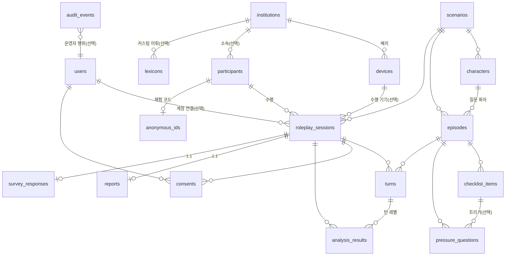

# 4-Fit 미러팅 데이터베이스 설계서

> 작성: 2026-07-07 · 대상: `backend/app/models/models.py` 기준 현행 스키마 → 기관 납품까지 커버하는 목표 스키마
> 근거 문서: `docs/prd.json`(기획서), 커밋 이력, 실제 API 쿼리 패턴

---

## 1. 설계 원칙

이 프로젝트의 DB는 두 단계의 수명주기를 가진다. **Phase A — 전시(EXPO)**: 오프라인 키오스크,
SQLite 단일 파일, 짧은 체험·즉시 리포트·1클릭 초기화. **Phase B — 기관 납품**: 대학/고용센터/기업
교육에서 반복 운영, 콘텐츠 편집, 익명 집계 대시보드, PostgreSQL 중앙 서버. 모든 설계 결정은 "전시에서
단순하게, 납품으로 갈 때 깨지지 않게"를 기준으로 한다.

| 원칙 | 내용 |
|---|---|
| **무결성은 DB가 최종 방어선** | 애플리케이션 검증과 별개로 FK·UNIQUE·CHECK가 항상 지킨다 (2026-07-07 적용 완료) |
| **원시 측정값과 해석의 분리** | `raw_metrics`(관측)와 `score`(해석)를 분리 저장 — 산식이 바뀌어도 재분석 가능 |
| **정량의 단일 진실은 `analysis_results`** | `reports`는 화면 렌더링용 문서(캐시). 집계·KPI는 `analysis_results`와 정규 컬럼에서 계산 |
| **스냅샷 원칙** | 세션이 참조한 콘텐츠(질문 텍스트 등)는 턴에 복사 저장 — 재시드/편집이 과거 리포트를 바꾸지 않는다 |
| **개인정보 최소화** | 기본 익명(`client_key`), 코드 매핑에 식별 정보 없음, 음성은 동의 정책에 따라 즉시 삭제/기한 보관 |
| **문서형 vs 관계형 판단 기준** | ① 다른 행이 참조하는가 ② 항목 단위로 수정되는가 ③ SQL로 집계하는가 — 하나라도 해당하면 테이블, 아니면 JSON |

---

## 2. 목표 ERD



---

## 3. 도메인별 설계

### 3.1 콘텐츠 도메인 — 운영자 편집(기관 시나리오 2)을 위한 정규화

현행은 `scenarios.characters`·`episodes.checklist`·`episodes.pressure_questions`가 JSON이고,
`episodes.character_id`가 JSON 내부 id를 가리키는 소프트 참조다. 시드로만 관리하는 전시 단계에선
문제없지만, PRD의 기관 운영 요구 — *"운영자는 시나리오 문구/난이도/금지어/코칭 문구 톤을 설정한다"* —
가 구현되는 순간 항목 단위 수정과 참조 무결성이 필요하다. 판단 기준(§1)에 따라 분리한다:

**테이블로 승격 (참조되거나 항목 단위로 수정됨):**

```sql
CREATE TABLE characters (
    id            INTEGER PRIMARY KEY,
    scenario_id   INTEGER NOT NULL REFERENCES scenarios(id) ON DELETE CASCADE,
    key           VARCHAR(50) NOT NULL,          -- 'kim_teamlead' (시드 호환 슬러그)
    name          VARCHAR(100) NOT NULL,
    role          VARCHAR(200) NOT NULL DEFAULT '',
    personality   TEXT NOT NULL DEFAULT '',
    speech_style  TEXT NOT NULL DEFAULT '',
    tts           JSON NOT NULL DEFAULT '{}',    -- {rate, pitch} — 표시 속성이므로 JSON 유지
    UNIQUE (scenario_id, key)
);

CREATE TABLE checklist_items (
    id                 INTEGER PRIMARY KEY,
    episode_id         INTEGER NOT NULL REFERENCES episodes(id) ON DELETE CASCADE,
    key                VARCHAR(50) NOT NULL,     -- 'conclusion_first' 등
    label              VARCHAR(200) NOT NULL,
    weight             REAL NOT NULL DEFAULT 1.0,
    followup_question  TEXT NOT NULL DEFAULT '', -- 누락 시 던질 후속 질문
    keywords           JSON NOT NULL DEFAULT '[]', -- 매칭 용어 목록 — 단일 속성이므로 JSON 유지
    "order"            INTEGER NOT NULL DEFAULT 0,
    UNIQUE (episode_id, key)
);

CREATE TABLE pressure_questions (
    id               INTEGER PRIMARY KEY,
    episode_id       INTEGER NOT NULL REFERENCES episodes(id) ON DELETE CASCADE,
    text             TEXT NOT NULL,
    trigger_item_id  INTEGER REFERENCES checklist_items(id) ON DELETE CASCADE,  -- NULL = any
    "order"          INTEGER NOT NULL DEFAULT 0
);

-- 금지어/권장어/쿠션어 — PRD '하이브리드 콘텐츠'의 편집 단위. NULL institution = 전역 기본값
CREATE TABLE lexicons (
    id              INTEGER PRIMARY KEY,
    institution_id  INTEGER REFERENCES institutions(id) ON DELETE CASCADE,
    kind            VARCHAR(20) NOT NULL CHECK (kind IN ('banned','recommended','cushion')),
    term            VARCHAR(100) NOT NULL,
    note            VARCHAR(200) NOT NULL DEFAULT '',
    UNIQUE (institution_id, kind, term)
);
```

**변경되는 기존 테이블:**

| 테이블 | 변경 | 근거 |
|---|---|---|
| `scenarios` | `characters` JSON 제거 → `characters` 테이블. `version INTEGER DEFAULT 1` 추가 | 재시드/편집 추적, 세션에 콘텐츠 버전 스냅샷 |
| `episodes` | `checklist`·`pressure_questions` JSON 제거. `character_id` → `characters.id` FK | 소프트 참조 제거. `modes`는 JSON 배열 유지(2개 값의 M:N 테이블은 과설계) |
| `turns` | `character_id VARCHAR` → `characters.id` FK `ON DELETE SET NULL` (nullable) | 캐릭터별 점수 집계 가능. 리포트 표시는 생성 시점에 스냅샷되므로 SET NULL로 충분 |

`world_setting`은 JSON 유지 — 참조·집계·항목 수정 어디에도 해당하지 않는 표시용 문서다.

### 3.2 참여자·동의 도메인 — "사람"을 일급 엔티티로

현행 `client_key`는 세션마다 문자열로 산재하고, 재도전율·추이·직전 비교가 전부 문자열 매칭이다.
개인정보 없이도 "동일 참여자"는 엔티티다:

```sql
CREATE TABLE participants (
    id              INTEGER PRIMARY KEY,
    client_key      VARCHAR(64) NOT NULL UNIQUE,   -- 프론트 localStorage UUID
    institution_id  INTEGER REFERENCES institutions(id) ON DELETE SET NULL,
    created_at      DATETIME NOT NULL,
    last_seen_at    DATETIME NOT NULL
);
-- roleplay_sessions.participant_id → FK, anonymous_ids.client_key → participant_id FK로 대체
```

효과: `/history`·재도전율·직전 세션 비교가 정수 FK 조인으로 바뀌고, 기관 스코프(어느 기관의
참여자인가)가 자연스럽게 생긴다. `anonymous_ids`(체험 코드)는 `participant_id` 1:1 매핑으로 단순해진다.

**`users`** — PRD 역할 정의(사용자/관리자)에 맞춰 `role VARCHAR(10) NOT NULL DEFAULT 'user'
CHECK (role IN ('user','admin'))` 추가. 현재 `/admin/*` API가 무인증인데, 기관 납품 시 반드시
관리자 인증이 필요하다.

**`consents`** — 동의는 **불변 이력**으로 취급한다. 정책 변경은 UPDATE가 아니라 새 행 삽입,
철회는 `revoked_at DATETIME` 기록. `storage_policy`에 `CHECK (storage_policy IN
('none','anonymous','account'))` 추가. (주체 존재 CHECK는 적용 완료.)

### 3.3 세션·대화 도메인

```sql
-- roleplay_sessions 추가 컬럼
participant_id   INTEGER REFERENCES participants(id) ON DELETE SET NULL,
device_id        INTEGER REFERENCES devices(id) ON DELETE SET NULL,  -- 어느 키오스크에서 수행
attempt_no       INTEGER NOT NULL DEFAULT 1,   -- 같은 참여자×시나리오×모드 내 회차
content_version  INTEGER NOT NULL DEFAULT 1,   -- 수행 시점의 scenario.version 스냅샷
-- CHECK (mode IN (5, 10)), CHECK (difficulty IN ('basic','pressure'))
```

`attempt_no`가 핵심이다. PRD KPI의 **"2차 수행률"과 "평균 4-Fit 점수 개선(1차→2차)"** 이 현재는
client_key 그룹핑으로 근사 계산되는데, 세션 생성 시 회차를 기록하면 두 KPI가 단순 GROUP BY가 된다.

`turns`는 현행 유지(스냅샷 원칙에 이미 충실). 실시간 코칭 팁(`nonverbal_metrics.tips`)은 세션당
수 건이라 JSON 유지가 맞고, 기관 단계에서 "코칭 발생 유형 통계"가 요구되면 그때 이벤트 테이블로 승격한다.

### 3.4 분석·리포트 도메인 — 단일 진실 원칙

**`analysis_results`** (턴 레벨 + 세션 레벨, 유니크 제약 적용 완료)에 한 컬럼을 추가한다:

```sql
engine_version  VARCHAR(20) NOT NULL DEFAULT '1'   -- 점수 산식 버전
```

측정 전문화 커밋(F0 억양·침묵 구조 등)처럼 산식은 계속 바뀐다. 버전 없이 쌓인 점수로 백분위·추이를
계산하면 "산식이 바뀐 날 이후 점수가 갑자기 오른" 왜곡이 생긴다. 백분위 계산은 동일 `engine_version`
표본으로 한정해야 공정하다.

**`reports`** 는 "화면 렌더링용 문서"로 역할을 명시한다. `fit_scores`·`evidence_segments`·
`rebuild`·`headline` 등 서사 JSON은 그대로 두되:

- `total_score`에 인덱스 추가 — 백분위 쿼리(`reports.py`)가 표본 커지면 스캔 대상
- `engine_version`·`content_version` 스냅샷 추가
- **집계는 reports JSON을 파이썬으로 순회하지 않는다** — `admin.py`의 fit별 평균은
  `analysis_results`(세션 레벨, `turn_id IS NULL`) SQL 집계로 전환:

```sql
SELECT fit_type, ROUND(AVG(score), 1)
FROM analysis_results WHERE turn_id IS NULL GROUP BY fit_type;
```

**`survey_responses`** (신규) — PRD KPI 3종(피드백 이해도·인간다움·개인화 체감)이 설문인데
저장할 곳이 없다:

```sql
CREATE TABLE survey_responses (
    id                  INTEGER PRIMARY KEY,
    session_id          INTEGER NOT NULL UNIQUE REFERENCES roleplay_sessions(id) ON DELETE CASCADE,
    q_clarity           INTEGER CHECK (q_clarity BETWEEN 1 AND 5),          -- 왜/어떻게가 명확했나
    q_empathy           INTEGER CHECK (q_empathy BETWEEN 1 AND 5),          -- 인간다움/공감
    q_personalization   INTEGER CHECK (q_personalization BETWEEN 1 AND 5),  -- 내 상황에 맞았나
    comment             TEXT NOT NULL DEFAULT '',
    created_at          DATETIME NOT NULL
);
```

### 3.5 기관·운영 도메인

- **`devices`** — `kind VARCHAR(20) DEFAULT 'kiosk' CHECK (kind IN ('kiosk','mirror','glass','web'))`,
  `app_version VARCHAR(20)` 추가 (PRD 디바이스 정의: 웹/스마트미러/스마트글래스). `last_ping_at`은
  키오스크 헬스체크용으로 유지 — 핑 시계열 테이블은 전시 규모에서 과설계.
- **`audit_events`** (신규) — 1클릭 초기화·CSV 내보내기·콘텐츠 수정은 파괴적/유출성 행위라 감사 기록이 필요:

```sql
CREATE TABLE audit_events (
    id          INTEGER PRIMARY KEY,
    user_id     INTEGER REFERENCES users(id) ON DELETE SET NULL,  -- NULL = 무인증 기간
    action      VARCHAR(50) NOT NULL,      -- 'exhibition_reset' | 'export_csv' | 'content_edit' ...
    payload     JSON NOT NULL DEFAULT '{}',
    created_at  DATETIME NOT NULL
);
```

- **`daily_stats`** (Phase B 선택) — 기관 대시보드가 "주간 접속·완료율·평균 점수"를 상시 조회하면
  일자×기관×시나리오 롤업 테이블(야간 배치 or 트리거)로 원본 스캔을 차단한다. PostgreSQL 전환 시
  materialized view로 대체 가능.

---

## 4. 인덱스 설계 (쿼리 주도)

유니크 제약이 만드는 인덱스(✅ = 적용 완료)로 대부분의 조회가 커버되며, 아래만 추가한다:

| 인덱스 | 지원하는 실제 쿼리 |
|---|---|
| ✅ `turns (session_id, order)` UNIQUE | 세션 턴 나열, 대화 엔진 진행 판단 |
| ✅ `analysis_results (session_id, turn_id, fit_type)` UNIQUE | 리포트 생성·턴 분해 조회 |
| ✅ `analysis_results (session_id, fit_type) WHERE turn_id IS NULL` | 세션 레벨 점수 조회, fit별 평균 집계 |
| ✅ `episodes (scenario_id, order)` UNIQUE | 모드별 에피소드 정렬 |
| ✅ `consents (session_id)` | 분석 후 저장 정책 확인 |
| ✅ `anonymous_ids (code)`, `(client_key)` UNIQUE | 코드 발급/입력 |
| ✅ `roleplay_sessions (client_key, id)` | `/history` 최근 10회, 직전 세션 비교(`reports.py`) — 둘 다 client_key 선두 + id 정렬 |
| ✅ `reports (total_score)` | 백분위 계산 |
| ✅ `roleplay_sessions (status)` 부분 인덱스 `WHERE status IN ('ready','in_progress','analyzing')` | 1클릭 초기화 — 활성 세션은 항상 소수 |

SQLite는 FK에 인덱스를 자동 생성하지 않으므로, **새 FK를 추가할 때는 "그 FK로 조회하는 쿼리가
있는가"를 확인하고 인덱스를 함께 선언**하는 것을 규칙으로 한다.

---

## 5. 무결성 규칙 총괄

| 계층 | 규칙 | 상태 |
|---|---|---|
| 연결 | `PRAGMA foreign_keys=ON` (SQLite는 기본 OFF) | ✅ 적용 |
| FK | 자식 소멸형은 `ON DELETE CASCADE`(turns, analysis_results, reports, consents.session, episodes), 참조 해제형은 `SET NULL`(user, institution) | ✅ 적용 |
| UNIQUE | `users.email`, `scenarios.slug`, `reports.session_id`, `anonymous_ids.code/client_key`, `(scenario_id,order)`, `(session_id,order)`, `(session_id,turn_id,fit_type)` + 세션 레벨 부분 인덱스 | ✅ 적용 |
| CHECK | `consents` 주체 존재 | ✅ 적용 |
| CHECK | `mode IN (5,10)`, `difficulty`, `storage_policy`, `role`, `attempt_no >= 1`, 설문 1~5 | ✅ 적용 (Phase 1) |
| CHECK (목표) | `lexicons.kind` — 콘텐츠 정규화와 함께 | Phase 2 |
| 시간 | naive UTC로 통일 (`utcnow()` 헬퍼 단일 경로) | ✅ 적용 |
| 애플리케이션 | 분석 재시도는 기존 결과 삭제 후 재계산(멱등) — 유니크 제약이 백스톱 | ✅ 적용 |

**상태 전이**(ready → in_progress → analyzing → completed / aborted)는 FSM 서비스가 강제하고
DB는 enum 저장만 담당한다 — 전이 규칙까지 DB 트리거로 넣는 것은 이 규모에서 유지비만 늘린다.

---

## 6. 데이터 수명주기 · 개인정보

| storage_policy | 음성 파일 | DB 레코드 | 근거 기능 |
|---|---|---|---|
| `none` (기본) | 분석 완료 즉시 삭제 (✅ 구현) | 익명 세션·점수만 보존 | S-CBYKOH |
| `anonymous` | `media_retention_days`(7일) 후 기동 시 삭제 (✅ 구현) | client_key로만 연결 | S-CBYKOH |
| `account` | 7일 보관 | user FK 연결 | 계정 저장 |

- **체험 코드**(`anonymous_ids`)는 식별 정보 0으로 설계 유지. 코드 유출 시 노출되는 것은 점수 추이뿐.
- **CSV 내보내기**는 client_key를 제외하고 있으나(✅), `participants` 도입 후에도 내부 id만 노출하도록 유지.
- **전시 종료 파기 절차**(운영 체크리스트): ① `--clean`으로 데모 데이터 제거 → ② CSV 아카이브(KPI 발표용)
  → ③ `media/` 전체 삭제 → ④ DB 파일 삭제. `audit_events`에 파기 기록.
- **계정 삭제 요청 시**: `users` 행 삭제 → 세션·동의는 `SET NULL`로 익명화되어 통계는 보존 (✅ FK 설계에 반영).

**백업(전시 중)**: WAL 모드이므로 운영 중에도 `sqlite3 mirror-ting.db "VACUUM INTO 'backup-$(date).db'"`
가 안전하다. 일과 종료마다 1회 권장.

---

## 7. 용량 추정 (전시 3일 기준)

시간당 최대 20세션 × 10시간 × 3일 ≈ **600세션**. 세션당 턴 ~6, 분석 결과 ~28(턴×fit + 세션 레벨),
리포트 1. 총 행 수 ~2만, JSON 포함 행당 수 KB → **DB 파일 수십 MB 미만**. 음성(WAV)은 DB 밖
`media/`에 두는 현 구조가 옳다(세션당 수 MB × 600 = 수 GB는 파일시스템 몫). SQLite로 충분하고도 남는
규모이며, 병목은 용량이 아니라 동시 쓰기 — WAL + busy_timeout으로 해결(✅).

---

## 8. PostgreSQL 이행 매핑 (Phase 3)

| SQLite (현행) | PostgreSQL (목표) | 비고 |
|---|---|---|
| `JSON` | `JSONB` | GIN 인덱스로 JSON 내부 검색 가능해짐 |
| `DATETIME` + naive UTC | `TIMESTAMPTZ` | `utcnow()`를 aware로 되돌리는 한 줄 변경 — 호출부가 헬퍼로 통일돼 있어 안전 (✅ 준비됨) |
| `INTEGER PRIMARY KEY` | `GENERATED ALWAYS AS IDENTITY` | SQLAlchemy가 자동 처리 |
| SQLAlchemy `Enum` | `TEXT` + CHECK 권장 | PG native enum은 값 추가마다 마이그레이션 필요 — 피한다 |
| 부분 인덱스 `sqlite_where` | `postgresql_where` 병기 | 모델에 두 dialect 인자 동시 선언 가능 |
| `busy_timeout` | 불필요 → 커넥션 풀(`pool_size`, `max_overflow`) 설정 | |
| `VACUUM INTO` 백업 | `pg_dump` + WAL 아카이빙 | |

이행 전제 조건: **Alembic** (아래 로드맵 Phase 2). 이행 시점에 멀티테넌시 스코프
(`institution_id`를 participants·sessions·lexicons에 일관 적용)를 함께 완성한다.

---

## 9. 마이그레이션 로드맵

| 단계 | 시점 | 내용 | 적용 방법 |
|---|---|---|---|
| **Phase 0** ✅ | 완료 (2026-07-07) | FK 강제·CASCADE, 유니크/CHECK 제약, WAL·busy_timeout, naive UTC 통일, modes JSON 배열, 재시도 멱등성 | DB 재생성 |
| **Phase 1** ✅ | 완료 (2026-07-07) | `engine_version`(analysis_results·reports + 백분위 표본 한정), `attempt_no`(+ 2차 수행률·1차→2차 개선 KPI), `survey_responses`(+ 제출 API·설문 평균 KPI), 인덱스 3종(§4), CHECK 4종, `users.role` + admin 가드(`MIRROR_TING_ADMIN_AUTH_REQUIRED`, 기본 off), `audit_events`(초기화·내보내기 기록), admin fit 집계 SQL 전환 | DB 재생성 (README 규칙) |
| **Phase 2** | 전시 후 ~ 기관 파일럿 | **Alembic 도입(이후 모든 변경은 마이그레이션)**, `characters`·`checklist_items`·`pressure_questions`·`participants`·`lexicons` 정규화, `anonymous_ids` → participant FK | Alembic 마이그레이션 |
| **Phase 3** | 기관 납품 | PostgreSQL 전환(§8), `daily_stats` 롤업, 멀티테넌시 완성, 코칭 이벤트 테이블 승격 검토 | Alembic + 데이터 이관 |

원칙: **전시 전에는 스키마를 넓히기만 하고(컬럼·테이블 추가) 구조를 바꾸지 않는다.** 구조 변경
(콘텐츠 정규화)은 재현 가능한 마이그레이션 도구(Alembic)와 함께 Phase 2에서 수행한다.
